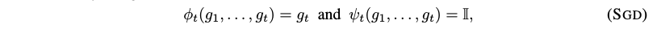

# On the convergence of ADAM and beyond

## S. Reddi, S. Kale, S. Kumar

---

## I - Introduction

* **SGD (Stochastic Gradient Descent)** : Update the parameters of a model by
moving them in the direction of
the negative gradient of the loss evaluated on a minibatch

* SGD is the dominant method to train deep networks (DNN) today

 

* **ADAGRAD (Adapative Gradient)** : Variant of SGD that scales coordnates
of the gradient by square roots of some form of averaging

* SGD variants in ADAGRAD's vein
have found success in **adjusting the learning rate on a per-feature basis**

 

* ADAGRAD's performance falls in nonconvex and dense settings, since the
entirety of past gradients are used in the updates.

* **ADAM (Adaptive Moment estimation)** : ADAGRAD idea where the rapid learning
rate decay is mitigated using the exponential moving average of squared past
gradients (limit reliance to only the past few gradients)

* This is also the idea of RMSPROP, ADADELTA, NADAM, ...

* Empirically, **ADAM fails to converge when important information happens rarely, because it is
forgotten too fast**
("*when some minibatches provide large
gradients but only quite rarely; although they are quite informative, their
influence dies out rather quickly due to exponential moving average*")

 

* In this paper :
  * **Counterexample of a convex optimization problem where ADAM
  does not converge**
  * Localization of the **error in ADAM's convergence proof**
  * ADAM variants with **long-term gradient memory**

---

## II - Preliminaries

### Optimization setup

* Online optimization problem in the full information feedback setting
(minimize regret)

* At each time step $t$ :
  * Pick a point $x_t \in \mathcal{F}$
    **(parameters of the model, e.g. weights)**
  * Access a loss function $f_t$
    **(loss of the model on the next minibatch)**
  * Incur loss $f_t(x_t)$

 

* **SGD** : $x_{t+1} = \Pi_{\mathcal{F}} (x_t - \alpha_t g_t)$ with
$g_t = \nabla f_t(x_t)$
(gradient descent projected onto the set of feasible points)

 

### Generic adaptive methods

 

 **Generic framework for adaptive algorithms** 

 

* Additional notes :
  * $\alpha_t$ step size
  * $\alpha_t V_t^{-1/2}$ learning rate
  * Restriction to $V_t = \text{diag}(v_t)$
  * Decreasing step size required for convergence

 

#### SGD

**SGD : Specifications in the framework** 

 

* Aggressive learning rate decay $\alpha / \sqrt(t)$

 

#### ADAGRAD

**ADAGRAD : Specifications in the framework** 

 

* Modest learning rate decay $\alpha / \sqrt{\sum_i g_{i,j}^2}$

 

#### ADAM

**ADAM : Specifications in the framework (main formulation)** 

**ADAM : Moment update formulation (alternative formulation)** 

 

* ADAGRAD with momentum (exponential moving average)

 
