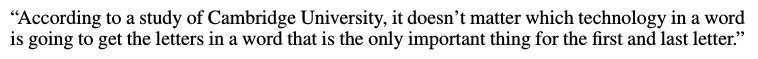

# Synthetic and natural noise both break Neural Machine Translation

## Y. Belinkov, Y. Bisk

---

## Abstract

NMT systems are becoming widely used; however, they are very brittle
compared to human performance when facing noise. In particular, both
synthetic and natural noise break NMT and drop their performance.

In particular, random scrambling as in the Cambridge meme sentence
'Aoccdrnig to a rscheearch...' makes performance fell down to ground level.
This is especially true for models based on character ordering, such as CNNs
or char2char models, when they are trained on clean datasets.

The authors investigate the effect of different types of noise on performance,
and show that even CNNs, when properly trained on various noise types,
are able to cope reasonably well even with random scrambling.

---

## I - Introduction

* Human language processing is surprisingly robust, easily overcoming typos,
misspellings, omission of letters, etc. A famous example is the 'Cambridge meme'
below.

 

**Cambridge meme** 

 

* In contrast, **Neural Machine Translation (NMT) systems are very brittle**
and spectacularly fail when faced with such noise, despite their careful
training and their widespread use.

 

**Google Translation of Cambridge meme (German -> English)** 

 

* NMT systems are rarely explicitly trained to address noise, and mainly
rely on the hope that the relevant noise will naturally occur frequently
in the training data.

* It is important to move to **character-based (or other sub-word units) NMT**.
It helps with out-of-vocabulary words and reduces the computational cost of
large word embedding matrices.Moreover, such models are able to extract stem and
morphological information to generalize to unseen situations.

* Unfortunately, **training on clean data makes models brittle.** Even small
amounts of noise lead to substantial drops in performance.

 

* In this paper :
  * **Investigation of the effects of noise on NMT**
  * Strategies for increasing model robustness:
    * **Structure-invariant representations**
    * **Robust training on noisy data** (adversarial training)
  * **Character CNN trained on an ensemble of noise types** robust to all kinds
  of noise

---

## II - Adversarial examples

* **Adversarial attacks** are becoming common in computer vision, and
amazingly efficient in changing the output of a model without altering the human
perception of the input. They have begun receiving increasing attention from the
NLP community.

* Adversarial attacks can be categorized into **white box (access to the model
parameters) or black box attacks**.

 

* **Adversarial training (including adversarial examples in the training data)**
can improve a model's ability to cope with such examples at test time.

* Robustness is further increased by **adversarial ensemble training**
(augmenting training data with adversarial examples crafted on other static
pre-trained models).

---

## III - MT systems

* **End-to-end** models in NMT are getting more and more thoroughly studied,
especially in their ability to learn various linguistic properties. The use of
**sub-word units** is an important component of these systems.

* This paper studies 3 different NMT systems with **access to character
information at different levels** :
  * `char2char` - sequence-to-sequence model with attention, trained on
  characters to characters; complex encoder with convolutional, highway, and
  recurrent layers; standard recurrent decoder.
  * `Nematus` - sequence-to-sequence model operating on sub-word units using
  Byte-Pair Encoding
  * ` charCNN` - sequence-to-sequence model with a word representation based
  on a character convolutional neural network; 2 LSTM layers in the encoder
  and decoder; a CNN over characters in each word replaces the word embeddings
  in the encoder

---

## IV - Data

### IV.2 - Noise : natural and artificial

#### IV.2.1 - Natural noise

* **Naturally occurring errors** (e.g. typos, misspellings) are extracted from
available corpora of edits to build a look-up table of possible lexical
replacements.

* Every word in the base corpus is then replaced with an error if one has
been registered.

 

#### IV.2.2 - Synthetic noise

* **Swap** : `noise -> nosie`

* **Middle Random** : `noise -> nisoe`

* **Fully Random** : `noise -> iones`

* **Keyboard Typo** : `noise -> noide`

---

## V - Failures to translate noisy texts

 

**BLEU scores on different test sets when trained on clean (Vanilla) texts**

 

 

**Translation of the Cambridge meme when trained on Vanilla texts** 

 

* The more noise in the text, the worse the translation quality, with random
scrambling producing the lowest BLEU scores.

* Correcting the input with **spell checkers** roughly adds +5 to the BLEU
scores in both French and German, but actually worsens the result in Czech.

---

## VI - Dealing with noise

### VI.1 - Structure invariant representations

* All three NMT models presented are **sensitive to word structure** (either
because of convolutional layers, or BPE sub-word units) **and character order**,
hence very sensitive to character scrambling noise.

* `meanChar` - generate a word representation by averaging character embeddings,
then proceed with a word-level encoder similar to `charCNN`.

* By construction, **`meanChar` is insensitive to scrambling**, although still
sensitive to typos and natural noise.

 

 

 

### VI.2 - Black-box adversarial training

* The model is presented with adversarial examples that are generated without
direct access to the model. The original training set is replaced with a noisy
training set, one for each type of noise.

 

 

 

* The robust training is sensitive to the kind of noise. Among the scrambling
methods, "harder" types of noise helps in training.

* **Training on one class of noise does not improve performance on other
classes.** In particular, only models trained on natural noise can reasonably
translate natural noise at test time.

* This indicates an **important difference between computational models and
human performance**, since humans are able to decipher random letter orderings
without any explicit training of this form.

 

* **Training on mixed noise datasets makes models robust to the specific types
of noise they were trained on.** In particular, the model trained on all
types of noise achieves the best average result, despite not being the best
on any one kind of noise.

 

**Translation of the Cambridge meme by a charCNN model trained on all types of
noise**
 

 

---

## VII - Analysis

### VII.1 - Learning multiple kinds of noise in charCNN

* `charCNN` performed well on all types of noise when trained on a mix of noise
types. This is unexpected, since convolutions should be sensitive to character
order.

* Suspicion : **different convolutional filters learn to be robust to different
kinds of noise.**

* In particular, we expect that with random scrambling there are no patterns
to detect in the data, so **filters resort to close to uniform weights.**
In contrast, typos and and natural noise introduce a large set of new patterns
for the CNN to try and learn. This is what we observe in the
**variances of the weights.**

 

**Variances of the weights of charCNN when trained on specific types of noise**
 

 

### VII.2 - Richness of natural noise

* Natural noise is very different from synthetic noise. **None of the models
that were trained only on synthetic noise were able to perform well on natural
noise.**

* Good synthetic errors will likely require more explicit phonemic and
linguistic knowledge. In addition, this shows the importance of developing
natural noise corpora, and understanding how humans cope with noise.
