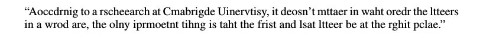

# Synthetic and natural noise both break Neural Machine Translation

## Y. Belinkov, Y. Bisk

---

## Abstract

---

## I - Introduction

* Human language processing is surprisingly robust, easily overcoming typos,
misspellings, omission of letters, etc. A famous example is the 'Cambridge meme'
below.

 

**Cambridge meme** 

 

* In contrast, **Neural Machine Translation (NMT) systems are very brittle**
when faced to such noise, despite their careful training and
their widespread use.

 

**Google Translation of Cambridge meme (German -> English)** 

 

* NMT systems are rarely explicitly trained to address noise, and mainly
rely on the hope that the relevant noise will naturally occur frequently
in the training data.

* It is important to move to **character-based NMT**, or other sub-word units.
It helps with out-of-vocabulary words, reduces the computational cost of
large word embedding matrices.

* Character-based NMT models are able to extract stem and morphological
information to generalize to unseen situations.

* Unfortunately, **training on clean data makes models brittle.** Even small
amounts of noise lead to substantial drops in performance.

 

* In this paper :
  * **Investigation of the effects of noise on NMT**
  * Strategies for increasing model robustness:
    * **Using structure-invariant representation**
    * **Robust training on noisy data** (adversarial training)
  * **Character CNN trained on an ensemble of noise types** robust to all kinds
  of noise

---

## II - Adversarial examples

* **Adversarial attacks** are becoming common in computer vision, and
amazingly efficient in changing the output of a model without altering the human
perception of the input.

* Adversarial attacks can be categorized into **white box (access to the model
parameters) or black box attacks**.

* Adversarial attacks begin receiving increasing attention from the NLP
community.

 

* **Adversarial training (including adversarial examples in the training data)**
can improve a model's ability to cope with such examples at test time.

* Robustness is further increased by **adversarial ensemble training.**

---

## III - MT systems

* 
