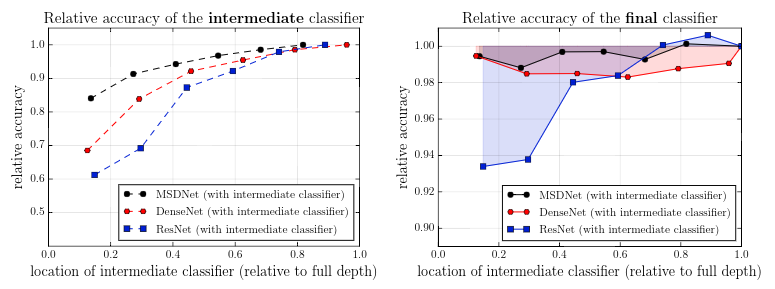
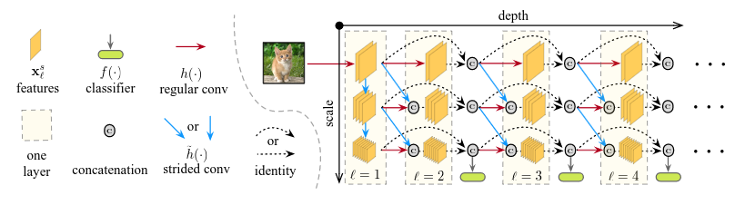
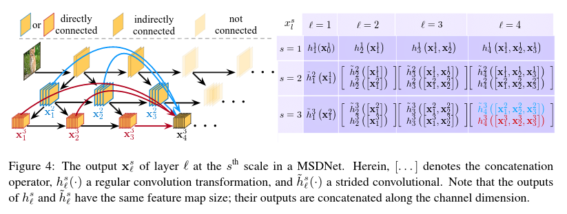
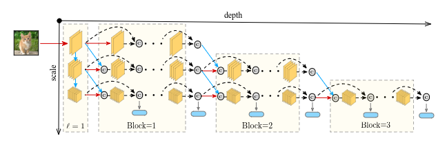
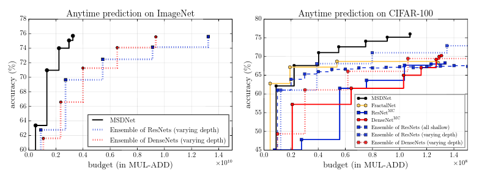
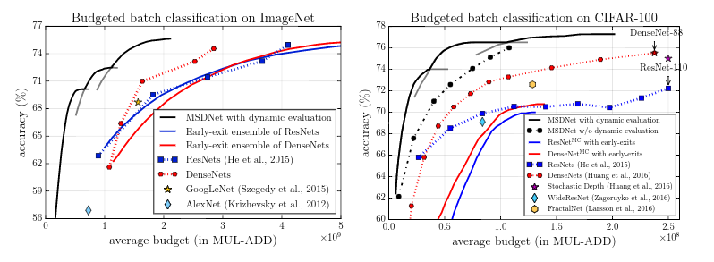

# Multi-Scale Dense Networks for resource efficient image classification

## G. Huang, D. Chen, T. Li, F. Wu, L. van der Maaten & K. Weinberger

---

## Abstract

The authors introduce a new CNN architecture, MSDNet, optimized for both
anytime prediction and budgeted batch prediction. It uses multi-scale feature
maps throughout the network (to introduce intermediate classifiers even at early
levels) and dense connectivity (to ensure classifiers do not interfere with each
other).

This has the interesting property of decoupling depth (horizontal dimension,
with bypasses coming from dense connectivity) and feature coarseness
(vertical dimension, leading to intermediate classifiers).
It performs very well on both problems mentioned.

---

## I - Introduction

* Visual object recognition competitions are usually won by computationally
intensive CNN models, which are the only one able to classify the hard examples
of the **tail of the data distribution.**

* However, such huge models are wasteful when applied to canonical images.

* Ideally, systems should **automatically use small networks when test images
are easy or computational resources limited, and big networks otherwise.**

 

* Two main tasks:
	* **Anytime prediction** : the network can be forced to output a prediction
	at any given point in time.
	* **Budgeted batch classification** : a fixed computational budget is shared
	across a large set of examples, and can be spent unevenly between easy and
	hard examples.

 

* Idea : **slice the computation and stop once time is depleted or
classification is certain (early exits).**

* Problem : CNN doesn't handle well early exits.
	1. Different kinds of features need to be extracted from the same input layer
		depending on how many layers are left until the classification
		(early vs. late features)
	2. Features in different layers typically have different scales
		(finer to coarser)

 

* In this paper :
	* **New architecture - Multi-Scale DenseNet (MSDNet)** for resource-efficient
	image classification
	* Problem 1 handled with **dense connectivity**
	* Problem 2 handled with **multi-scale structure**

---

## II - Related work

### Computation-efficient networks

* Mostly **reducing model size after training** (pruning, quantization)

* Learning compact models with less parameter redundancy
(knowledge-distillation)

 

### Resource-efficient machine learning

* Mostly **exploiting characteristics of ML models** (that do not apply to DL)
to incorporate feature computation into the training of the model
(e.g. Viola & Jones)

* **Adaptive computation time** (Graves, 2016)

 

### Related network architectures

* **Neural fabrics** (Sexena & Verbeek, 2016) rapidly construct a low-resolution
feature map usable for direct classification, whilst also maintaining feature
maps of higher resolution for higher accuracy in later classifiers.

* **DenseNets** (Huang et al., 2017) bypass early-classifiers-optimized features
to feed later layers of the network.

---

## III - Problem setup

### Anytime prediction

* **Finite computational budget $B>0$ for each test example $x$**.

* Assuming **$B ~ P(x,B)$**, the goal of the anytime learner is to **minimize
$L(f) = \mathbb{E}[L(f(x),B)]_{P(x,B)}$.**

 

## Budgeted batch classification

* Classify a set $D_{test}$ of examples with a fixed budget $B$.

* Minimize $L(f(D_{test}), B)$.

---

## IV - Multi-Scale Dense Convolutional Networks

* Straightforward solution : train multiple networks of increasing size,
evaluate them sequentially at test time. Far from optimal
(results never reused).

* Alternative solution : **build a deep network with a cascade of classifiers**
operating on the features of the internal layers.

* However, naive early-exit classifiers to a standard DNN hurts performance.
Two problems are exposed below.

 

**Early-exits hurt performance. Results on CIFAR-100.**

 

**Proposed solution architecure : MSDNet**

 

#### Problem : The lack of coarse-level features

* Early layers lack coarse-level features, early classifiers won't perform well

* **Solution** : **multi-scale features maps, all the classifiers only use
coarse-level features.** Horizontal connections preserve and progress
high-resolution information; vertical connections produce coarse features for
classification.

 

#### Problem : Early classifiers interfere with later classifiers

* Intermediate classifiers optimize features for the short-term performance,
not later layers.

* **Solution** : **dense connectivity** to bypass short-term features.

 

### IV.1 - The MSDNet architecture

 

 

* **Classifiers use all previous coarse features**. Each classifier is a CNN
with 2 convolutional layers, one pooling and one linear.

* In anytime prediction, the most recent prediction is returned.

* In batch budget, an example traverses the network and exits after classifier
$k$ if its prediction confidence exceeds a pre-determined threshold $\theta_k$,
designed to ensure the budget constraint is verified.

* **Training loss** is a weighted cumulative cross-entropy loss.

 

#### Network reduction and lazy evaluation

* We want to further reduce computational requirements

 

**Scale reduction**

 

* **Scale reduction** : inefficient to maintain all the finer scales until
the last layer.

* **Lazy evaluation** : group computation in diagonal blocks such that we only
propagate the example along paths that are required for the next classifier.

---

## V - Experiments

### V.1 - Anytime prediction

**Anytime prediction performance (top-1).  
Evaluation is performed against FractalNet, deeply supervised networks
(MC standing for multiple classifiers)
and various ensembles of fixed or varying size.**

 

* In the extremely-low-budget regime, ensembles have an advantage since the
smaller network is directly and independently optimized for this task.

 

### V.2 - Budgeted batch classification

**Budgeted batch performance (top-1).  
Evaluation is performed against standard CNNs
and various ensembles of fixed or varying size.**

 

* Dynamic evaluation allows for very precise tuning of the computational
budget that is consumed, which is not possible with individual networks.

 

### V.3 - More computationally efficient DenseNets

* DenseNets tend to apply more filters on the high-resolution feature maps,
compared to standard CNNs like ResNets. this helps reducing the number of
parameters, but greatly increases the computational cost.

* **Keeping the number of output channels (growth rate) the same at all scales
did not yield optimal results in terms of the accuracy-speed trade-off.**

* Doubling the growth rate after each transition layer yields much better
results.
