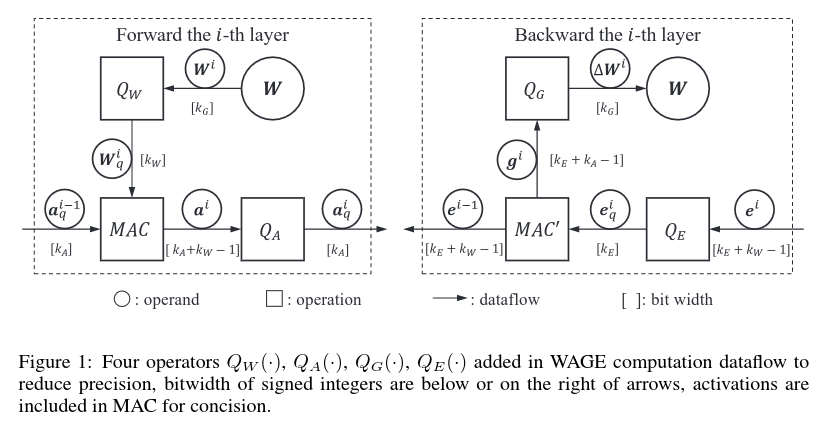
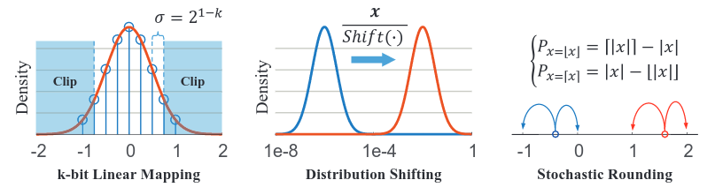
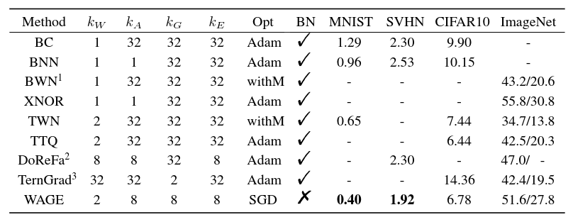
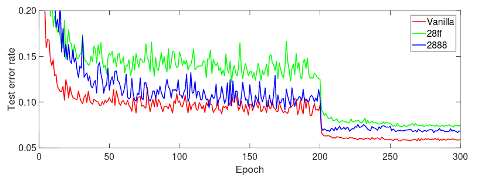

# Training and inference with integers in Deep Neural Networks

## S. Wu, G. Li, F. Chen, L. Shi

---

## Abstract

Smaller or more resource-efficient neural networks have begun receiving
increasing attention over the past few years, as well as their deployment
to dedicated hardware.

In this paper, the authors propose the WAGE framework where weights,
activations, gradients and errors are quantized to low-bitwidth integers.
They investigate size requirement during training and inference,
dedicated quantization functions, and show a good trade-off between accuracy
and energy requirements of their model.

---

## I - Introduction

* Deep Neural Networks (DNN), although widely used, need **energy-intensive
devices (CPU, GPU, TPU, ...) during training** to achieve a good performance
in reasonable time.

* DNN also typically consist in millions of parameters (138M for VGG-16),
and are therefore **very heavy to store**, notwithstanding the increased
overfitting opportunities.

* Therefore much attention has been brought to **reducing the size of the
networks, as well as deploying dedicated hardware.**

 

* **Training typically requires higher precision (gradient descent).** Most
papers hence study the compression of standard networks trained with full
precision.

* In this paper :
  * **How to process both training and inference of DNNs with low-bitwidth
    integers**
    * How to quantize all operands and operations
    * How many bits are needed for SGD computation and accumulation
  * **WAGE framework** (constrains Weights, Activations, Gradients, Errors)

---

## II - Related work

* **Focus on reducing precision of operands and operations in both training
and inference.**

* Orthogonal complexity reduction techniques like network compression, pruning,
compact architectures.

 

#### Weights and activations

* BNN : binary weights and activations, but still real-valued variables for
gradients accumulation.

* XNOR-Net : filter-wise scaling factor for weights, efficient implementation
of convolutions.

* TWN, TTQ : ternary-valued weights with two symmetric thresholds.

 

#### Gradient computation and accumulation

* DoReFa-Net : quantized gradients to low-bitwidth floats with discrete states
in the backward pass.

* TernGrad : ternary-valued gradients to reduce the overhead of gradient
synchronization in distributed training.

* However both works use float32 weights during training, and ignore the
quantization of batch normalization.

---

## III - WAGE quantization

* Notation : errors $e^i = \frac{\partial L}{\partial a^i}$,
gradients $g^i = \frac{\partial L}{\partial W^i}$. MAC stands for
multiply-accumulate ($x + y \times z$).

* Main idea : **quantize weights $W$ and activations $a$ during inference,
errors $e$ and gradients $g$ during backpropagation.**

 

 

#### Forward propagation

* Weights are stored with $k_G$-bit integers.

* Find a **good quantization function $Q_W(\cdot)$ that maps higher precision
weights to their $k_W$-bit reflections.**

* Although weights are accumulated with high precision, the deployment of
reflections in dedicated hardware is much more efficient after training.

* Quantize activations to compensate for the increased bitwidth caused by MACs.

 

#### Backward propagation

* Quantize gradients and errors to compensate for the increased bitwidth caused
by MACs.

 

### III.1 - Shift-based linear mapping and stochastic rounding

* Notation : $\sigma(k) = 2^{1-k}, k \in \mathbb{N}_+$

* Quantization function :
**$Q(x,k) = Clip \{\ \sigma(k) \cdot round[\frac{x}{\sigma(k)}],\
-1+\sigma(k),\ 1-\sigma(k)\}$**

* To avoid permanent saturation, use a scaling factor
**$Shift(x) = 2^{round(\log_2 x)}$**

 

 

### III.3 - Quantization details

* Use a **layer-wise shift based scaling factor** to attenuate the amplification
effect (variances of the weights are scaled by quantization, which would make
the network's outputs explode).

* Avoid average pooling, given that they need more precision

* **Batch normalization is replaced by the scaling factor mentioned** (assumes
batches have zero-mean).

 

* It seems that **it is the orientations rather than the orders of magnitude
in errors that guide previous layers to converge**; hence we scale the errors
distribution into a fixed interval.

* Since only relative values of errors are preserved after shifting, gradients
are shifted accordingly.

* There only remains directions for weights to change, and the **step sizes are
integer multiples of minimum step $\sigma$.**

 

* **Drop memory-consuming techniques** such as momentum, L2 regularization
(quantization and randomness added amount for empirically sufficient
regularization), avoid softmax and cross-entropy (use Sum of Squared Error).

---

## IV - Experiments

* First build the computation graph for a vanilla network, then
**insert quantization nodes in forward propagation and override gradients
in backward propagation** for each layer (in Tensorflow).

 

### IV.1 - Results

 

 

### IV.2 - Training curves and regularization

 

**Test error rate during training.  
28ff model has no quantization nodes in backpropagation.  
Learning rate is set to 0.1, divided by 10 at epochs 200 and 250.**

 

* When comparing models 28ff and 2888, it seems that the **discretization
of backpropagation somehow acts as another type of regularization.**

 

### IV.3 - Bitwidth of errors

* Btiwidth of errors is chosen to truncate at best the distribution of errors
**(regularization)** while retaining the approximate orientations for
backpropagation.

* 8-bit size is chosen for its reasonable accuracy-size trade-off and its
matching with various feature encodings and hardware choices.

 

### IV.4 - Bitwidth of gradients

* The inconsistent bitwidth between weight updates $k_G$ and their effects in
inference $k_W$ provides indispensable buffer space. Otherwise, there might be
too many weights changing their ternary values in each iteration, making
training very slow and unstable.

* **Intermediate variables like feature maps often consume much more memory
than weights**, so 8-bit size is a reasonable trade-off.

---

## V - Discussion and future work

* Compared to 16-bit floats, **8-bit integer operations reduce the energy and
area costs for integrated circuits design by a factor of 5**, but also halve
the memory accesses costs and memory size requirement during training.

* One could consider going 2-2-8-8, but **ternary $a$ will dramatically slow
down convergence and hurt accuracy.**

* **Non-linear quantization methods like logarithmic representation might be
more efficient** since weights and activations in a trained network naturally
seem to have log-normal distribution.

* Softmax and batch normalization are avoided for computational reasons in WAGE,
but **a good quantized normalization is of high interest.**
