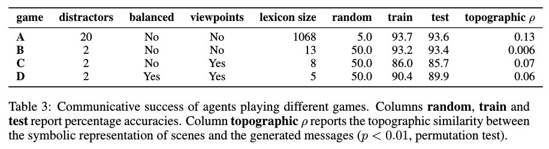
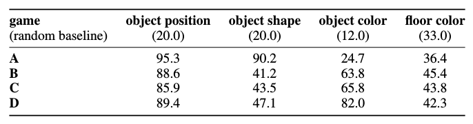

<h1> Emergence of linguistic communication from referential games with symbolic
and pixel input </h1>

## A. Lazaridou, K. M. Hermann, K. Tuyls, S. Clark

---

## Abstract

This paper studies the ability of neural (Deep Learning) agents to learn
(compositional) communication protocols with reinforcement learning. The authors
show that with symbolic inputs (disentangled), the agents are able to
successfully learn a structured compositional communication protocol.

When it comes to raw pixel inputs, communication can also be achieved,
but the protocols are very unstable and their compositionality is hampered
by the agents' ability to separate the objects' factors of variations.

Altogether, this work scales up traditional research on language emergence
to the powerful deep learning framework, and corroborates the hypothesis that
structured compositional language is most likely to emerge when agents perceive
the world as structured.

---

## I - Introduction

* Study of emergent communication:
  * **language evolution** - development of communication protocols from scratch
  * **language acquisition** - learning of an existing language

 

* Focus on **how environmental or pre-linguistic conditions affect the nature
of the communication protocol that an agent learns.** Increasing realism and
complexity.

* Intuition that language derives meaning from its use.

* Context of a **simple referential game**, where one agent must communicate to
another a target object in the agent's environment.

 

* **Compositionality** : smaller building blocks are used to generate
unbounded numbers of more complex forms, with the meaning of the larger being
determined by the meanings of its parts and how they are put together.

* Compositionality allows virtually infinite expression, and is one of the most
important properties of natural language.

* In this paper:
  * Two referential communication games to study **how much structure is
  provided by the environment** (same setup, learning procedure, architecture)
  * Study 1 - symbolic input, disentangled representations, dimensions encode
  individual properties
  * Study 2 - raw perceptual input, entangled input, no pre-coded semantics
  * **Learning agents can successfully communicate in both cases, but struggle
  to produce structured messages when presented with entangled input data.**

---

## II - Referential games as multi-agent co-operative reinforcement learning

* General framework in which two agents take discrete actions in their
environment in order to **maximize a shared reward.**

 

### II.1 - Game and terminology

* A **speaker** is presented with a **target object $t$** (among the set of
**pre-linguistic items**, e.g. pixel-based images). Using an **alphabet**
(primitive discrete **symbols**, e.g. ('22','10','0', '2')), the speaker
constructs a **message** describing that object (e.g. '22 0 2').

* The set of all distinct messages generated by the speaker is referred to as
their **lexicon** or **protocol**.

* The **listener** is presented with the target and a set of **distractor
objects** $C$ (also among the pre-linguistic set), and - by making use of the
message - has to identify the true target object.

* **Communicative success** is the correct identification of the target
by the listener.

 

**Referential game setting: the listener tries to guess the target object among
a set of candidate objects, by making use of the speaker's message.**

 

### II.2 - Agents

* The speaker :
  * **Encodes $t$** into a dense representation $u$ using an encoder (dependent
    on the pre-linguistic set)
  * **Generates a message $m$** based on $u$ and the alphabet (symbols of the
    alphabet have no a priori meaning), using a **decoder** (here single-layer
    LSTM).

 

* The listener :
  * **Encodes all candidates $c$** using an encoder (similar to, but
    independent of the speaker's encoder)
  * **Encodes the message $m$** using an encoder (here a single-layer LSTM)
    to produce an **encoding $z$.**
  * **Predicts a target object $t' \in C$** based on $z \cdot u_c$  

 

### II-3. Learning

* All weights of the speaker and listener (encoders, decoders) are jointly
optimized.

* **No weights are shared between both agents, the only supervision is
communicative success.**

 

**Reward function, with $R(t') = \mathbb{1}_{\{t=t'\}}$**

 

---

## III - Study 1: Referential game with symbolic data

* **Structured and disentangled input** (bag-of-attributes, all pre-linguistic
  items are represented in terms of binary vectors $o \in \{0,1\}^{573}$).
  Each object can be seen as a conjunction of properties.

* Speaker and listener convert the pre-linguistic representations to dense
representations $u$ by using a single-layer MLP.

* 4 distractors, alphabet of 100 symbols.

 

### III.1 - Agent performance and ambiguity

 

**Results of Study 1.   `alphabet size` denotes the effective size of the
symbol set used, `lexicon size` the effective number of unique messages used,
`topographic $\rho$` the structural similarity in terms of Spearman correlation
between the message and the object vector space.**

 

* In the shortest message setting, we observe a **high ambiguity**, each message
being used to denote 11 concepts on average. Hypothesis : difficult
exploration + ambiguous protocols are good local optima.

* This situation is termed **partial equilibrium pooling**, and can be countered
by increasing the search space (increasing allowed message length).

 

### III.2 - Realistic context distribution

* In the real world, distractors are not drawn from a uniform distribution
(context and co-occurence). An additional experiment is designed with
**distractors sampled from a target-specific distribution.**

 

 

* The context-dependent setting initially makes the problem easier,
but similar objects are more likely to appear together as candidates,
and the overall game becomes more difficult.

* **Confusability** : some objects getting mapped to the same message
  * In the uniform case, object similarity is a predictor of object
  confusability
  * In the context-dependent case, object confusability is rather driven by
  (non-)co-occurence (to better distinguish co-occurring objects)

 

* Thus **the choice of distractors has an effect on the organization (and
potentially the naturalness) of the emerged language**, for example as
reflected in the semantics of ambiguous or homonym words in the language.

 

### III.3 - Structural properties of emerged protocols

* **No consensual metric to quantify the degree of compositionality**;
here, the choice taken is to measure the **ability to generalize to novel
data.**

 

#### III.3.1 - Generalization to novel objects

* Three sets of unseen object, by decreasing degree of resemblance with the
training data :
  * **test** - same data distribution as training data (but never seen)
  * **unigram chimeras** - property-based distribution inferred from the
  training data
  * **uniform chimeras** - data with uniformly sampled properties

 

 

* **Productivity** - speakers are able to concoct novel messages on-the-fly
(see `lexicon_size` for the percentage of novel messages), and listeners prove
able to comprehend them.

 

#### III.3.2 - Topographic similarity

 

 

* **Topographic similarity is the correlation of the distances between all
possible pairs of meanings and the corresponding pairs of signals.**

* Regarding the formula, topographic similarity is the negative Spearman
correlation between Levensthein distance and cosine similarity.

* Intuitively, it measures the point to which similar (resp. dissimilar)
objects share much (resp. little) of the message structure (e.g. prefixes).

* Results suggest that structured and disentangled pre-linguistic
representations are a sufficient condition for the emergence of structured
languages (in addition, neural agents tend to favor similar inputs to
trigger similar outputs).

---

## IV - Study 2: Referential game with raw pixel data

* **Raw and entangled input** (raw pixel input
$o \in [0,255]^{3 \times 124 \times 124}$ to visually process first).
Combination of shape, color, location and floor color (40 000 combinations).

* Variants of the game :
  * A - 19 distractors, 3000 objects
  * B - 1 distractor, 3000 objects
  * C - 1 distractor, and speaker and listener have different viewpoints
  (different relative locations perceived), 1850 objects
  * D - 1 distractor, different viewpoints, and balanced numbers of shapes
  and color (by downsampling from 8 to 5 colors), 1850 objects

 

* Speaker and listener convert the images $o$ to dense representations $u$
using a 8-layer CNN (not pre-trained).

* Conceptually, we can think of the whole speaker/listener architecture as
an **encoder/decoder with a discrete bottleneck (the message).**

* Even though no weights were shared, the agents' conceptual spaces get aligned
at different levels.

 

### IV.1 - Communicative success and emergent protocols

 

 

* Reinforcement learning agents trained end-to-end are able to establish
a communication protocol in this grounded environment.

* In game A, as captured by topographic similarity, **agents produce messages
that respect (to some degree) the compositional nature of scenes, indicating
that similar scenes correspond to similar messages.** For example, the message
prefix and suffix consistently denote the horizontal and vertical co-ordinate
respectively.

 

* However, **the emerged protocols are very unstable and too grounded in the
specific game situation.**

* Small modifications of the game setup, having little to no impact on the
performance, can radically alter the form, semantics and interpretability
of the communication protocol (few unique messages, only-color-based messages,
...).

* Without any bias or knowledge, **communication behavior is a function
of environmental pressures - protocols essentially overfit the particular game
situation** to the degree that they become specialized *ad hoc* naming
conventions

 

### IV.2 - Probe models

* Linear probe classifiers on $u$ (result of ConvNet on $t$).

 

**Accuracy of linear classifier probes on $u$ (percentage)**

 

* Object position is almost always encoded in the speaker's visual
representation, even when it's not a good strategy.

* Shape is rarely taken into account, although it is relevant for communication,
at least in C and D.

* **Disentanglement seems to be a necessary condition for communication**,
at least in the case of pixel input.
