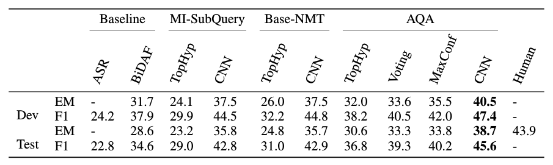
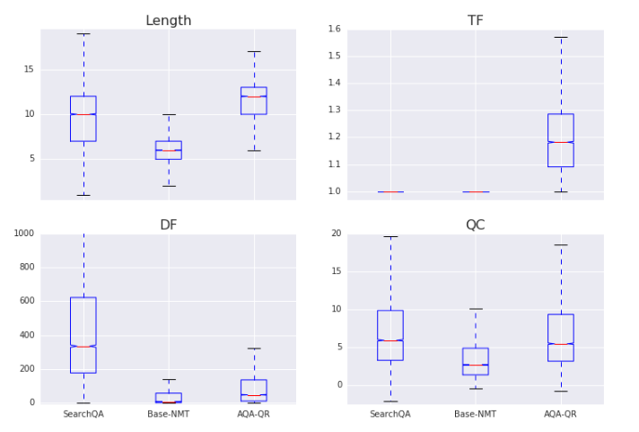

<h1> Asking the right questions:  
Active question reformulation with reinforcement learning </h1>

<h2> C. Buck, J. Bulian, M. Ciaramita, W. Gajewski,
A. Gesmundo, N. Houlsby, W. Hang </h2>

---

## Abstract

Question answering systems are improving with the years and the recent use
of neural models. However, even when trained on natural language questions,
it is likely that some questions would be more easily answered if they
were reformulated, like humans often do.

The authors present an AQA agent, for *active question answering*, which sits
between the user and a black-box question answering environment, and learns
to reformulate natural questions in order to get the best answer from the QA
environment.

The setting is framed as a Reinforcement Learning problem and trained with
Policy Gradient. When evaluated on a dataset of *Jeopardy!* questions, the
AQA agent shows an improvement over the performance of a state-of-the-art
QA network.

The agent proves able to learn non-trivial reformulation policies, resembling
classical information retrieval techniques such as tf-idf and term re-weighting.

---

## I - Introduction

* In the face of complex information needs, humans have the ability to
**reformulate in order to ask the right question.**

* Reproduce this behavior with an agent **AQA (active question answering)**
that sits the user and a backend QA system (environment).

 

* AQA aims to maximize the chance of getting the correct answer by sending a
reformulated question to the environment.

* Two components of the AQA:
  * Sequence-to-sequence model trained with **Reinforcement learning** using a
  reward based on the answer returned by the environment (black-box probing
  using only question strings)
  * Convolutional neural network to combine the evidences returned by the
  environment to **select an answer**

 

* AQA is a machine-machine communication instance, **able to learn non-trivial
reformulations** such as stemming, tf-idf, term re-weighting.

---

## II - Related work

* Previous work:
  * Paraphrasing to augment the training of a semantic parser
  * Pivoting through auxiliary languages, for NMT or paraphrasing

* In contrast, this method a **direct neural paraphrasing system that generates
full question reformulations** while optimizing directly end-to-end.

 

* Policy gradient methods allow sequence-level reward functions and prevent
**exposure bias** (in word-level training, the model is trained on ground
truth pre-sequences, while it is tested on its own generated pre-sequences,
hence a discrepancy between training and test sets).

 

* Previous work:
  * Query reduction networks with policy gradient
  * Improvement of document retrieval by reformulating queries with added
  terms from documents retrieved from a search engine for the original query

---

## III - Active Question Answering model

 

**AQA agent-environment setup**

 

* An episode starts with an original question $q_0$. The agent then **generates
a set of reformulations** $\{q_i\}_{i=1..N}$. The environment returns answers
$\{a_i\}_{i=1..N}$. The selection model then **picks the best candidate**.

 

### III.1 - Question-answering evironment

* **BiDAF (BiDirectional Attention Flow)** - extractive QA system (selects an
answer from contiguous spans of a given document) (Seo et al., 2017)

* Quality metric chosen is the **token-level F1 score**.

 

### III.2 - Reformulation model

* Sequence-to-sequence model, trained on multilingual translation, then adapted
to monolingual paraphrasing (little high quality monolingual training data).

 

### III.3 - Answer selection model

* Selects the best answer by predicting the difference of the F1 score to the
average F1 score of all variants.

* Pre-trained embeddings for the tokens of query, rewrite and answer are each
passed through a 1-dimensional CNN and max-pooling, then all concatenated
and passed through a feed-forward network which produces the output.

---

## IV - Training

### IV.1 - Question answering environment

* BiDAF is trained on the relevant training set for the QA task, then
becomes a black-box and is not further updated.

* Joint optimization of the environment and the AQA would be possible, but is
not the purpose of this study.

 

### IV.2 - Policy gradient training of the reformulation model

* Find $a^* = \text{argmax}_a R(a|q_0)$

* The reward $R$ is computed with respect to $q_0$, while the answers are
provided for **$q \sim \pi_{\theta}(\cdot|q_0)$** with:

<strong>

\[
  \pi_{\theta}(q = w_1..w_T|q_0) = \prod_{t=1}^T
  p_{\theta}(w_t|w_1..w_{t-1}, q_0)
\]

</strong>

 

* The goal is to maximize
**$\mathbb{E}_{q \sim \pi_{\theta}(\cdot|q_0)}[R(f(q))]$**, estimated via
Monte Carlo sampling

* The reward is optimized directly with respect to the parameters $\theta$
of the policy using Policy Gradient methods. The gradients are computed using
REINFORCE (likelihood ratio method), estimated via Monte Carlo sampling:

\[
  \nabla \mathbb{E}_{q \sim \pi_{\theta}(\cdot|q_0)}[R(f(q))] =
  \mathbb{E}_{q \sim \pi_{\theta}(\cdot|q_0)}
  [\nabla_{\theta} \log(\pi_{\theta}(q|q_0))R(f(q))]
\]

 

* Note: There seems to be a problem with the baseline reward mentioned in
the paper. $B(q_0) = \mathbb{E}_{q \sim \pi_{\theta}(\cdot|q_0)}[R(f(q))]$
is fixed when $\theta$ and $q_0$ are fixed, hence
$\mathbb{E}_{q \sim \pi_{\theta}(\cdot|q_0)}[R(f(q)) - B(q_0)] = 0$ by linearity
of the expectation, which means we're basically optimizing $0$. A more
reasonable choice of baseline would maybe be $B(q_0) = R(f(q_0))$.

 

* Collapse onto a sub-optimal deterministic policy is addressed using
**entropy regularization**:

\[
  H[\pi{\theta}(q|q_0)] = - \sum_{t=1}^T \sum_{w_t \in V}
  p_\theta(w_t|w_{<t},q_0) \log p_\theta(w_t|w_{<t},q_0)
\]

 

<strong>

* Final objective:

\[
  \mathbb{E}_{q \sim \pi_{\theta}(\cdot|q_0)}[R(f(q)) - B(q_0)]
  + \lambda H[\pi{\theta}(q|q_0)]
\]

</strong>

 

### IV.3 - Answer selection

* Each rewrite is sent to the QA environment, yielding a set of (query, rewrite,
answer) tuples from which we need to pick the best instance.

* Framed as a binary classification task (above/below average performance),
solved with another neural network (here CNN).

 

### IV.4 - Pretraining of the reformulation model

* Firs build a multilingual translation system, which can be used for
**zero-shot translation**, i.e. to translate between language pairs for which
it has seen no training examples (learned encoder and decoder for each language,
just need to pick a pair).

* Zero-shot translation usually performs worse than bridging, but the
performance gap can be closed by training for a few steps on the desired pair.

* Here, the model is first trained on multilingual data, then on a small corpus
of monolingual data.

---

## V - Experiments

* SearchQA dataset, built from a set of *Jeopardy!* clues. Used to train the
QA environment.

* Evaluation against:
  * **Baseline**
    * Attention Sum Reader
    * BiDAF alone
  * **MI-SubQuery**: generates reformulation candidates by keeping the top
  $N=20$ subqueries (of all generated from the original query) ranked by
  mutual information
    * TopHyp: pick the top hypothesis generated by the sequence model $q_1$
    * CNN answer selector
  * **Base-NMT**: no RL training
    * TopHyp: pick the top hypothesis generated by the sequence model $q_1$
    * CNN answer selector

 

* **Tested AQA models**:
  * TopHyp: pick the top hypothesis generated by the sequence model $q_1$
  * Voting: heuristic weighted voting scheme based on BiDAF scores
  * MaxConf: pick the single highest BiDAF score across reformulations
  * CNN answer selector

 

### Results

 

**Results in F1 and Exact Match scores, during training and test**

 

* As seen in AQA + TopHyp, the reformulator alone is able to produce easier
questions (2.2 F1 improvement on test set)

* AQA + Voting/MaxConf are based on the intuition that when BiDAF is confident
in its answer it is more likely to be correct, and multiple instances of the
same answer provide positive evidence - further improvement.

* AQA + CNN improves performance further, using a trained selection function,
closing half the gap between BiDAF and human performance.

---

## VI - Analysis of the agent's language

* The AQA can converge to a sub-optimal deterministic policy - trade-off
in entropy regularization.

* Competitive sub-optimal policy: generate minimal changes to the input, in
order to stay close to the original question.

* However, empirically the AQA is **able to learn non-trivial reformulation
policies**.

 

### VI.1 - General properties

* Note: queries are pre-processed and resemble keyword-based search queries

 

**Query statistics for different models:   Length of the query, mean Term
Frequency, median Document Frequency, Query Clarity**

 

* Base-NMT (+ TopHyp) improves structural language quality (inserting words and
wh-phrases), yielding mostly syntactically well-formed questions, and rewrites
that are 50% more likely than the original questions.

* AQA (+ TopHyp) rewrites nearly all start with *"What is name"* (while this
virtually never occurs in Base-NMT nor in the original queries), which is
puzzling.

* AQA rewrites seem less fluent than their counterparts, but they have more
repeated terms, are longer, and contain more informative context terms than
SearchQA questions (lower DF).

 

## VI.3 - Discussion

* Recently, Lewis et al. (2017) trained chatbots to negotiate via language
utterances in order to complete a task. They report that the agent's language
diverges from human language if there is no incentive for fluency.

* This study shares corroborating findings. AQA learns to re-weight terms
by focusing on informative and query-specific terms, while increasing
term frequency via duplication.

* Some of the techniques seem to adapt to the specific properties of current
deep QA architectures (e.g. character-based modeling and attention).
**Sometimes the AQA learns to generate nonsensical, novel term variants**, e.g.
transforming *dense* to *densey*.

 

* Suspicion that AQA optimizes a language that increases the likelihood of
BiDAF **ranking** better the candidate answers.

* Jia & Liang (2017) argue that **reading comprehension systems seem not capable
of significant language understanding and fail easily in adversarial settings.**

* Suspicion that current machine comprehension tasks involve mostly pattern
matching and relevance modeling; deep QA systems might just implement
sophisticated ranking systems trained to sort snippets of texts from the
context. This makes them re-discover information retrieval techniques such as
tf-idf re-weighting and stemming.
