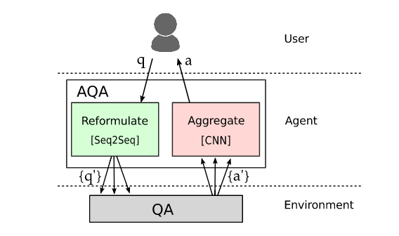

<h1> Asking the right questions:  
Active question reformulation with reinforcement learning </h1>

<h2> C. Buck, J. Bulian, M. Ciaramita, W. Gajewski,
A. Gesmundo, N. Houlsby, W. Hang </h2>

---

## Abstract

---

## I - Introduction

* In the face of complex information needs, humans have the ability to
**reformulate in order to ask the right question.**

* Reproduce this behavior with an agent **AQA (active question answering)**
that sits the user and a backend QA system (environment).

 

* AQA aims to maximize the chance of getting the correct answer by sending a
reformulated question to the environment.

* Two components of the AQA:
  * Sequence-to-sequence model trained with **Reinforcement learning** using a
  reward based on the answer returned by the environment (black-box probing
  using only question strings)
  * Convolutional neural network to combine the evidences returned by the
  environment to **select an answer**

 

* AQA is a machine-machine communication instance, **able to learn non-trivial
reformulations** such as stemming, tf-idf, term re-weighting.

---

## II - Related work

* Previous work:
  * Paraphrasing to augment the training of a semantic parser
  * Pivoting through auxiliary languages, for NMT or paraphrasing

* In contrast, this method a **direct neural paraphrasing system that generates
full question reformulations** while optimizing directly end-to-end.

 

* Policy gradient methods allow sequence-level reward functions and prevent
**exposure bias** (in word-level training, the model is trained on ground
truth pre-sequences, while it is tested on its own generated pre-sequences,
hence a discrepancy between training and test sets).

 

* Previous work:
  * Query reduction networks with policy gradient
  * Improvement of document retrieval by reformulating queries with added
  terms from documents retrieved from a search engine for the original query

---

## III - Active Question Answering model

 

**AQA agent-environment setup**

 

* An episode starts with an original question $q_0$. The agent then **generates
a set of reformulations** $\{q_i\}_{i=1..N}$. The environment returns answers
$\{a_i\}_{i=1..N}$. The selection model then **picks the best candidate**.

 

### III.1 - Question-answering evironment

* **BiDAF (BiDirectional Attention Flow)** - extractive QA system (selects an
answer from contiguous spans of a given document) (Seo et al., 2017)

* Quality metric chosen is the **token-level F1 score**.

 

### III.2 - Reformulation model

* Sequence-to-sequence model, trained on multilingual translation, then adapted
to monolingual paraphrasing (little high quality monolingual training data).

 

### III.3 - Answer selection model

* Selects the best answer by predicting the difference of the F1 score to the
average F1 score of all variants.

* Pre-trained embeddings for the tokens of query, rewrite and answer are each
passed through a 1-dimensional CNN and max-pooling, then all concatenated
and passed through a feed-forward network which produces the output.

---

## IV - Training

### IV.1 - Question answering environment

* BiDAF is trained on the relevant training set for the QA task, then
becomes a black-box and is not further updated.

* Joint optimization of the environment and the AQA would be possible, but is
not the purpose of this study.

 

### IV.2 - Policy gradient training of the reformulation model

* Find $a^* = \text{argmax}_a R(a|q_0)$

* The reward $R$ is computed with respect to $q_0$, while the answers are
provided for **$q \sim \pi_{\theta}(\cdot|q_0)$** with:

<strong>

\[
  \pi_{\theta}(q = w_1..w_T|q_0) = \prod_{t=1}^T
  p_{\theta}(w_t|w_1..w_{t-1}, q_0)
\]

</strong>

 

* The goal is to maximize
**$\mathbb{E}_{q \sim \pi_{\theta}(\cdot|q_0)}[R(f(q))]$**, estimated via
Monte Carlo sampling

* The reward is optimized directly with respect to the parameters $\theta$
of the policy using Policy Gradient methods. The gradients are computed using
REINFORCE (likelihood ratio method), estimated via Monte Carlo sampling:

\[
  \nabla \mathbb{E}_{q \sim \pi_{\theta}(\cdot|q_0)}[R(f(q))] =
  \mathbb{E}_{q \sim \pi_{\theta}(\cdot|q_0)}
  [\nabla_{\theta} \log(\pi_{\theta}(q|q_0))R(f(q))]
\]

 

* Note: There seems to be a problem with the baseline reward mentioned in
the paper. $B(q_0) = \mathbb{E}_{q \sim \pi_{\theta}(\cdot|q_0)}[R(f(q))]$
is fixed when $\theta$ and $q_0$ are fixed, hence
$\mathbb{E}_{q \sim \pi_{\theta}(\cdot|q_0)}[R(f(q)) - B(q_0)] = 0$ by linearity
of the expectation, which means we're basically optimizing $0$. A more
reasonable choice of baseline would maybe be $B(q_0) = R(f(q_0))$.

 

* Collapse onto a sub-optimal deterministic policy is addressed using
**entropy regularization**:

\[
  H[\pi{\theta}(q|q_0)] = - \sum_{t=1}^T \sum_{w_t \in V}
  p_\theta(w_t|w_{<t},q_0) \log p_\theta(w_t|w_{<t},q_0)
\]

 

<strong>

* Final objective:

\[
  \mathbb{E}_{q \sim \pi_{\theta}(\cdot|q_0)}[R(f(q)) - B(q_0)]
  + \lambda H[\pi{\theta}(q|q_0)]
\]

 

### IV.3 - Answer selection

* 
