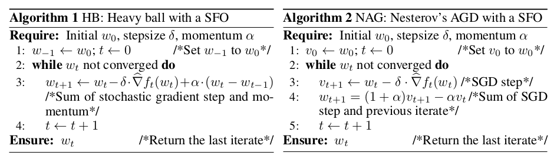

<h1> On the insufficiency of existing momentum schemes for Stochastic
Optimization </h1>

## R. Kidambi, P. Netrapalli, P. Jain, S. M. Kakade

---

## Abstract

---

## I - Introduction

* **First order optimization methods** (FOOM) rely solely on the gradient of the
function (or an unbiased approximation thereof), that is the first order
derivative. They are thus distinct from second order optimization methods
such as Newton's algorithm, which rely on the Hessian of the function.

* The simplest FOOM is **Gradient Descent**, but it is known to be
**suboptimal** for smooth convex problems among others.

* **Fast gradient, or momentum-based methods** achieve optimal convergence
rates:
  * **Heavy ball method** (HB in a stochastic setting)
  * **Nesterov's accelerated gradient descent** (NAG)

 

* Deep learning (DL) and large datasets have favored the development of
**momentum Stochastic Gradient Descent** (SGD) algorithms, cheap and efficient.

* However, classical momentum methods require **exact gradients** (on the full
dataset), while they are implemented in practice with **stochastic gradients**
(on a mini-batch).

 

*Are momentum methods optimal even in the <strong> stochastic first
order oracle (SFO) </strong>, where we access stochastic gradients computed on
small-constant-sized mini-batches (including batches of size 1)?*

 

* It is not known if momentum methods provide any provable improvements over SGD
in the SFO model. For some problem instances, it is **information theoretically
impossible to improve upon SGD**.

* **Accelerated SGD (ASGD)** (Jain et al., 2017) uses a variant of NAG updates.
It is proven to improve over SGD whenever it is allowed by information
theory.

 

* In this paper:
  * **HB is provably not optimal in the SFO model**
  * HB and NAG sub-optimality is rather widespread
  * HB and NAG work well in DL thanks to mini-batching (reduces variance,
    reduces the gap with exact gradients)
  * ASGD works well with both small and large batch sizes

---

## II - Notations

* Optimize $f(w) = 1/n \sum_i f_i(w)$ over parameters $w$.

* Exact gradient $\nabla f(w)$, stochastic gradient $\hat{\nabla} f(w)$

* Condition number $\kappa$ of the Hessian of $f$ in linear regression

 

---

## III - Suboptimality of the Heavy Ball method

*
