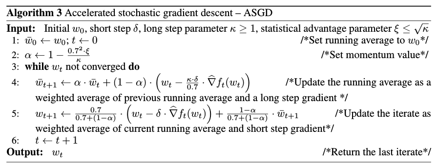
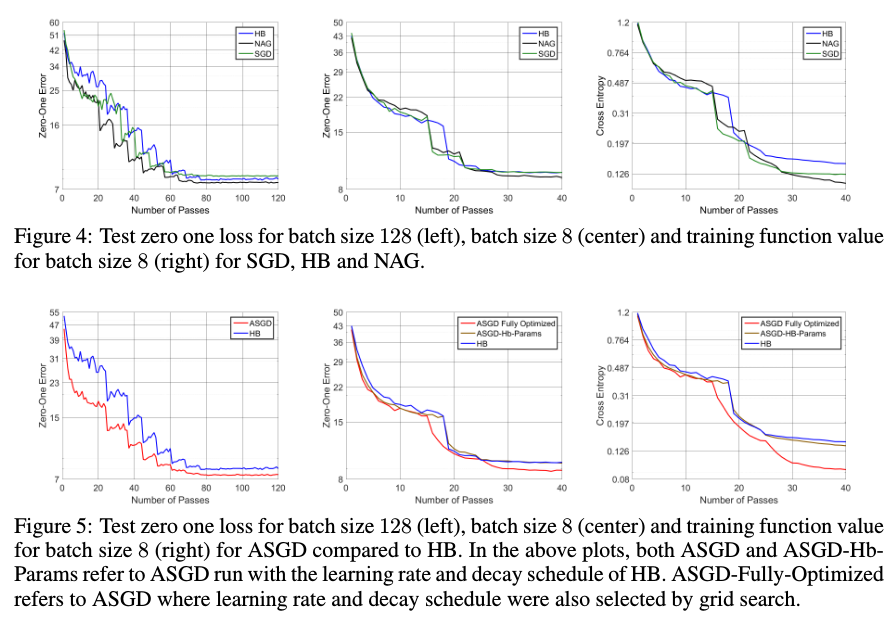

<h1> On the insufficiency of existing momentum schemes for Stochastic
Optimization </h1>

## R. Kidambi, P. Netrapalli, P. Jain, S. M. Kakade

---

## Abstract

Optimization algorithms relying on the acceleration of SGD (momentum-based
methods) have been very successful in deep learning applications. They usually
are variants of two schemes, the Heavy Ball method or the Nesterov acceleration
scheme. Although the theoretical performance of those schemes has been proven with
exact gradients, it remains unclear whether they exhibit a performance
improvement over SGD in the stochastic setting.

The authors show in this paper that Heavy Ball is suboptimal in the Stochastic
First Order setting, by designing a linear regression problem where it does
not perform better than SGD. On the other hand, they also come up with the
Accelerated Stochastic Gradient Descent (ASGD) algorithm, which seems to
consistently outperform both schemes in the SFO setting. They furthermore argue
that the practical success of common acceleration schemes are due to
mini-batching (the performance drops for batch size of 1).

---

## I - Introduction

* **First order optimization methods** (FOOM) rely solely on the gradient of the
function (or an unbiased approximation thereof), that is the first order
derivative. They are thus distinct from second order optimization methods
such as Newton's algorithm, which rely on the Hessian of the function.

* The simplest FOOM is **Gradient Descent**, but it is known to be
**suboptimal** for smooth convex problems among others.

* **Fast gradient, or momentum-based methods** achieve optimal convergence
rates:
  * **Heavy ball method** (HB in a stochastic setting) - take a SGD step,
  then gamble (momentum step).
  * **Nesterov's accelerated gradient descent** (NAG) - gamble first (momentum
  step), then correct your mistake with a SGD step at current location.

 

* Deep learning (DL) and large datasets have favored the development of
**momentum Stochastic Gradient Descent** (SGD) algorithms, cheap and efficient.

* However, classical momentum methods require **exact gradients** (on the full
dataset), while they are implemented in practice with **stochastic gradients**
(on a mini-batch).

 

*Are momentum methods optimal even in the <strong> stochastic first
order oracle (SFO) </strong>, where we access stochastic gradients computed on
small-constant-sized mini-batches (including batches of size 1)?*

 

* It is not known if momentum methods provide any provable improvements over SGD
in the SFO model. For some problem instances, it is **information theoretically
impossible to improve upon SGD**.

* **Accelerated SGD (ASGD)** (Jain et al., 2017) uses a variant of NAG updates,
decoupling some step parameters from the exponential decay factor of past
gradients averaging. It is proven to improve upon SGD whenever it is allowed by
information theory.

 

* In this paper:
  * **HB is provably not optimal in the SFO model**
  * HB and NAG sub-optimality is rather widespread
  * HB and NAG work well in DL thanks to mini-batching (reduces variance,
    reduces the gap with exact gradients)
  * ASGD works well with both small and large batch sizes

---

## II - Notations

* Optimize $f(w) = 1/n \sum_i f_i(w)$ over parameters $w$.

* Exact gradient $\nabla f(w)$, stochastic gradient $\hat{\nabla} f(w)$

* Condition number $\kappa$ of the Hessian of $f$ in linear regression

 

**Common forms of the Heavy Ball (HB) and Nesterov's Accelerated Gradient
descent (NAG) algorithms**

 

**ASGD (Jain et al., 2017) algorithm**

---

## III - Suboptimality of the Heavy Ball method

* There exists **linear regression problems where the performance of HB is no
better than that of SGD, while ASGD significantly improves upon SGD's
performance**.

* The authors design such a setting in a fairly generic and simple fashion. We
refer the reader to the original paper for details. The main point is that, in
some ill-conditioned problems, HB's convergence rate is much more affected by
the condition number $\kappa$ [$\Omega(\kappa \log{\frac{1}{\epsilon}})$]
than ASGD [$O(\sqrt{\kappa} \log{\kappa} \log{\frac{1}{\epsilon}})$].

---

## IV - ASGD algorithm

* The **short step parameter $\delta$** is precisely the same as the
step size in SGD.

* The **long step parameter $\kappa$** is an estimate of the ratio of the
largest and smallest curvatures on the function; for convex functions, this is
the condition number.

* The **statistical advantage $\xi$** is a trade-off between statistical and
computational condition numbers (cf Jain et al., 2017). The higher the
stochasticity, the smaller it should be.

 

* The algorithm maintains two iterates, the descent iterate $w_t$ and the
running average $\bar{w_t}$. The idea is that the algorithm is that since the
algorithm takes a long step, a short step and an appropriate average of both of
them, it can **make progress in different directions at a similar pace**.

---

## V - Experiments

* *Even for linear regression, is the HB suboptimality widely spread or
limited to specific distributions? What about NAG?*

* *Is the in-practice superiority of HB and NAG related to mini-batching,
and are there guidelines on the batch size to use?*

* *How does ASGD perform on deep learning in comparison with SGD, HB and NAG?*

 

### V.1 - Linear regression

* SGD, HB and NAG all show a nearly linear dependence of the convergence rate
on the condition number $\kappa$, while ASGD seems to scale linearly with
$\sqrt{\kappa}$.

 

### V.2 - Deep auto-encoders for MNIST

* Standard benchmark for the evaluation of optimization algorithms.

* **HB and NAG benefit from large batch sizes (closer to exact gradients), but
they do not outperform SGD with batch size of 1**.

* ASGD converges faster than both methods across different batch sizes.

 

### V.3 - Deep ResNets for CIFAR-10

 

 

* On low batch sizes, SGD, HB and NAG exhibit a very similar convergence rate.
On higher batch sizes, NAG outperforms SGD.

* ASGD consistently outperforms SGD, HB and NAG across a range of batch sizes.

---

## VI - Related work

### First order oracle methods

* GD is sub-optimal for smooth convex optimization (addressed by HB and NAG).

 

### SFO methods and noise stability

* SGD has been extremely effective, and is very widely used.

* **Accelerating SGD is tricky, since it would be very unstable when dealing
with noise.**

* The performance of HB and NAG is not well understood in the SFO model.

 

### Understanding Stochastic HB

* HB with noisy gradients does not offer performance improvements, unless
strong assumptions are made.

* The authors show here that those improvements are at best constant factors
over SGD performance, whereas ASGD offers real improvements.

 

### Accelerated and Fast Methods for finite sums

* Finite sums are also known as offline stochastic optimization.

* SDCA, SAG, SVRG, SAGA offer linear convergence rates (much better than SGD),
and have accelerated variants. However, they require storing the entire training
set in memory and taking multiple passes over the same.

* In deep learning, this is most of the time infeasible because of the large
amount of data involved.

 

### Practical methods for deep networks

* Momentum methods with stochastic gradients have become standard and very
popular in DL. The authors argue that their performance stems from
mini-batching rather than improvement on the SFO model.

* The advantages offered by Adagrad, RMSProp, Adam are important, and orthogonal
to the advantages offered by fast gradient methods; an integration of ASGD into
those would be highly profitable.
