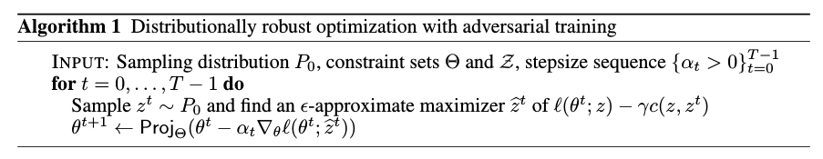
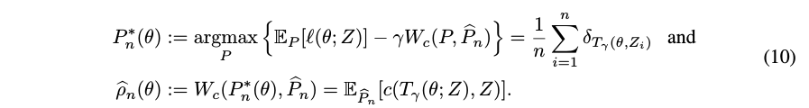
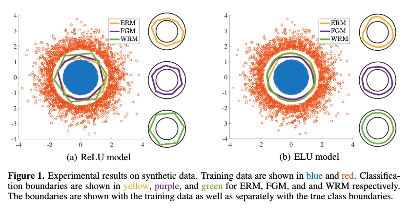
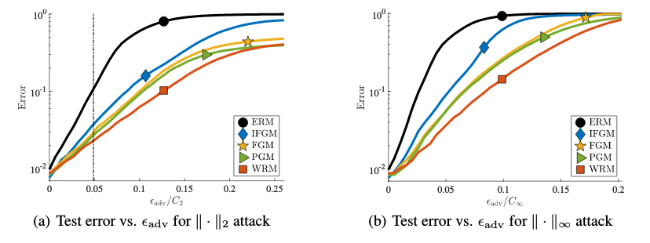
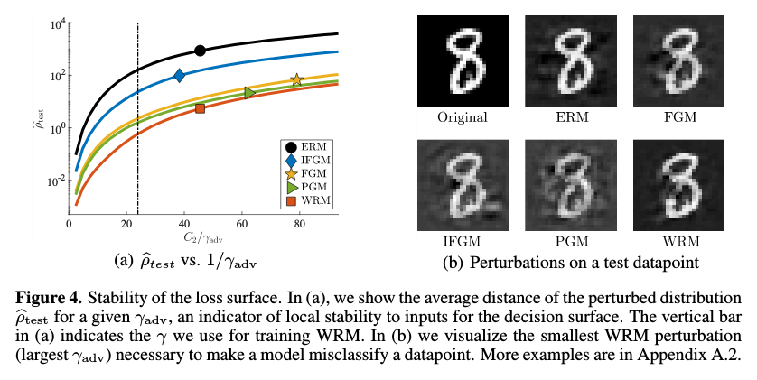

<h1>Certifying some distributional robustness with principled
adversarial training</h1>

## A. Sinha, H. Namkoong, J. Duchi

---

## Abstract

Neural networks are known to be quite sensitive to adversarial attacks,
and a number of defense mechanisms have been presented to provide some
robustness to the algorithms. However, most of the previously proposed mechanism
either rely on specific assumptions on the structure of the loss function,
describe approaches that are intractable in practice,
or are merely heuristics with little to no theoretical guarantee on the
granted robustness.

The method proposed here considers adversarial examples drawn from probability
distributions that lie close to the true distribution of the data (in a
Wasserstein-metric sense); it leverages a Lagrangian relaxation of the
adversarial robustness problem to provide an easy, principled, and efficient
adversarial training procedure. Additionally, the authors derive a
data-driven certificate of robustness, and show that their method matches or
outperforms other adversarial training settings like Fast Gradient Methods.

---

## I - Introduction

* Classical supervised learning framework:
  * Minimize an expected loss $\mathbb{E}_{P_0}[l(\theta ; Z)]$
  * over a parameter $\theta \in \Theta$
  * where $Z \sim P_0$, $P_0$ probability distribution over the space
  $\mathcal{Z}$, $l$ loss function

 

* **Robustness to changes in the data-generating distribution $P_0$ is often
highly desirable**, be they naturally occurring (e.g. covariate shift) or
adversarial attacks.

* Neural networks are vulnerable to adversarial attacks (e.g. can lead to
misclassification). Defense mechanisms are at early stages only, the classes of
attacks against which they are effective are not well known, and the formal
verification of a network is generally NP-hard.

 

### In this paper

* Efficient procedures for **distributionally robust optimization** with
rigorous guarantees for small to moderate amounts of robustness.

* For a class $\mathcal{P}$ of probability distributions around $P_0$:
<strong>
\[
\min_{\theta \in \Theta} \sup_{P \in \mathcal{P}} \mathbb{E}_P[l(\theta ; Z)]
 \ \ \ \ \ \ \ \ (1)
\]
</strong>

* The authors propose:
  * Robustness sets $P$ with computationally efficient relaxations
  * An adversarial training procedure with nice convergence guarantees,
  that generalizes defense to the test dataset

 

### Approach overview

* We consider an adversarial cost $c(z,z_0)$ of perturbing $z_0$ to $z$, and a
robustness region $\mathcal{P} = \{P : W_c(P,P_0) \leq \rho \}$ as a Wasserstein
ball around $P_0$.

* Problem (1) is generally intractable for deep networks and arbitrary $\rho$.
We consider a **Lagrangian relaxation** of the problem:
\[
\min_{\theta} \{F(\theta) :=
  \sup_P{}\{\mathbb{E}_P[l(\theta ; Z)] - \gamma W_c(P,P_0)\}\}
  \ \ \ \ \ \ \ \ (2a)  
\]

* It happens that this relaxation can be reformulated as:
<strong>
\[
\min_{\theta} \{F(\theta) :=
  \mathbb{E}_{P_0} [\phi_\gamma(\theta ; Z)] \}
  \ \ \ \ \ \ \ \ (2b)  \\
  \text{where } \phi_\gamma(\theta ; z_0) :=
  \sup_z \{l(\theta ; z) - \gamma c(z,z_0)\}
\]
</strong>

 

* For smooth losses $l$, and large enough penalty $\gamma$ (i.e. small enough
robustness $\rho$), $\phi_\gamma$ (**robust surrogate of $l$ that allows
adversarial perturbations with a budget constrained by $\gamma$**) computation
is simply strongly concave optimization, which is easy, providing nice
convergence guarantees.

 

### Related work

#### Robust optimization and adversarial training

* Standard robust optimization approach: minimize $\sup_{u \in \mathcal{U}}
l(\theta;z+u)$ for some uncertainty set $\mathcal{U}$. This is intractable
except for specially structured losses.

* Heuristic perturbations of the training data (e.g. fast gradient sign method)
yield models with unclear convergence and adversarial coverage.

 

#### Distributionally robust optimization

* The choice of $\mathcal{P}$ yields a **trade-off between richness of the
uncertainty and tractability of the computation**.

* Previous approaches:
  * parametric classes
  * $f$-divergence balls (fixed support)
  * Wasserstein balls (varying support) (studied in tractable but limited cases)

---

## II - Proposed approach

* Main idea: assume $l(\theta; \cdot)$ is *smooth*, i.e. $\nabla_z
l(\theta;\cdot)$ is $L$-Lipschitz for some $L$. Then a Taylor expansion shows
that **$(l(\theta;\cdot) - \gamma c(\cdot, z_0))$ is $(\gamma - L)$-strongly
concave**.

* Hence, for moderate enough robustness $\rho$ requirements (i.e. by duality
large enough penalty $\gamma$), $\phi_\gamma(\theta ; z_0) =
\sup_z \{l(\theta ; z) - \gamma c(z,z_0)\}$ is easy to compute. That is, **with
essentially no additional computational cost, we can train on the worst possible
perturbation instead of the raw training data**.

* The Wasserstein metric is a natural way to compare two probability
distributions, especially when one is derived from the other by small,
non-uniform perturbations. Viewing a probability distribution as a unit
amount of 'dirt' piled on $\mathcal{Z}$, the Wasserstein distance is
intuitively the minimal cost of turning one pile into the other
(amount moved times the distance it is moved). The authors show that using a
Wasserstein ball yields the equivalence between $(2. a)$ and $(2. b)$.

 

### II.1 - Optimizing the robust loss by Stochastic Gradient Descent

* Assuming strong convexity of the cost $c(\cdot,z_0)$ and Lipschitzian
smoothness of all gradients of the loss $l$, the authors show that:

 

* This essentially means that for $l$ smooth and $\gamma$ large enough,
computing the worst case perturbation has a linear cost, for each data point.
We can hence perform the following training:

 

* When previous assumptions hold, this algorithm (with SGD) has a guaranteed
convergence rate in $1/\sqrt{T}$.

* **The smoothness of $l$ is essential to ensure tractability, meaning one
needs to replace standard ReLU activations with sigmoid or ELU activations**
in order to get such a convergence rate.

---

## III - Certificate of robustness and generalization

### III.1 - Certificate of robustness

* We note $T_\gamma(\theta;z_0) := \text{argmax}_{z \in \mathcal{Z}}
\{

* The empirical maximizers of the Lagrangian formulation of the problem are,
understandably, the "worst-case perturbation" of the empirical distribution,
and the associated robustness:

 

* **The empirical worst-case loss $\mathbb{E}_{P_n^\times} [l(\theta;z)]$ hence
gives a certificate of robustness to Wasserstein perturbations up to level
$\hat{\rho_n}$.**

* We then have a data-dependent upper-bound for the worst-case population
objective with high probability:

<strong>

\[
  \sup_{P:W_c(P,P_0)\leq \rho} \mathbb{E}_P[l(\theta;z)] \leq
  \gamma \rho + \mathbb{E}_{\hat{P}_n}[\phi_\gamma(\theta;Z)] + O(1/\sqrt{n})
\]

</strong>

 

### III.2 - Generalization of adversarial examples

* We show that $\hat{\rho}_n(\theta)$, the level of robustness achieved for
the empirical problem, uniformly converges to its population counterpart
$\mathbb{E}_{P_0}[c(T_\gamma (\theta;Z),Z)]$ at a (usual) rate of $\sqrt{d/n}$,
meaning that there is no overfitting of the robustness to the training data.

---

## IV - Experiments

* Performance of the proposed algorithm (**WRM**) is compared to:
  * ERM - Empirical Risk Minimization (standard)
  * FGM - Fast Gradient Method (perturb with a small step in the steepest
    direction, steadily computable) (Goodfellow et al., 2015)
  * IFGM - Iterated FGM (Kurakin et al., 2016)
  * PGM - Projected-Gradient Method (project the gradient ascent of FGM on a
    p-norm ball around $x$) (Madry et al., 2017)

 

* The adversarial literature usually considers strong adversaries with
$\infty$-norm-attacks, allowing imperceptible perturbations to all input
features. Here, a reasonable framework of $2$-norm-attacks is chosen, with
cost $c_x(x,x') := ||x-x'||^2_2$.

 

### IV.1 - Visualizing the benefits of certified robustness

 

 

* Since more data (70%) are from the blue class, we expect distributional
robustness to favor pushing the classification boundary outwards, since
adversarial examples are intuitively more likely to come from pushing blue
points outwards across the boundary.

* WRM pushes the boundary further outwards, and the result advocate for the
use of **smooth activation functions such as ELU**.

 

### IV.2 - Learning a more robust classifier on MNIST

 

 

* Training with the Euclidean norm still provides robustness to
$\infty$-norm fast gradient attacks.

 

 

* Small values of $\hat{\rho}_{test}$, the distance to adversarial examples,
correspond to small magnitudes of $\nabla_z l(\theta;z)$ in a neighborhood of
the nominal input, i.e. stability of the model (as opposed to an estimator
highly varying in the data).

* This sums up the method's defense mechanism against gradient-based attacks:
**create a more stable loss surface by reducing the magnitude of gradients
and improving their interpretability**.

---

## V - Discussion and future work

* Future investigation:
  * Get better guarantees for larger robustness requirements
  * Improve theoretical bounds to make the method usable in deep learning
  * In the large-perturbation setting, go beyond $\infty$-norm attack and
  defense to tackle perceptible attacks
