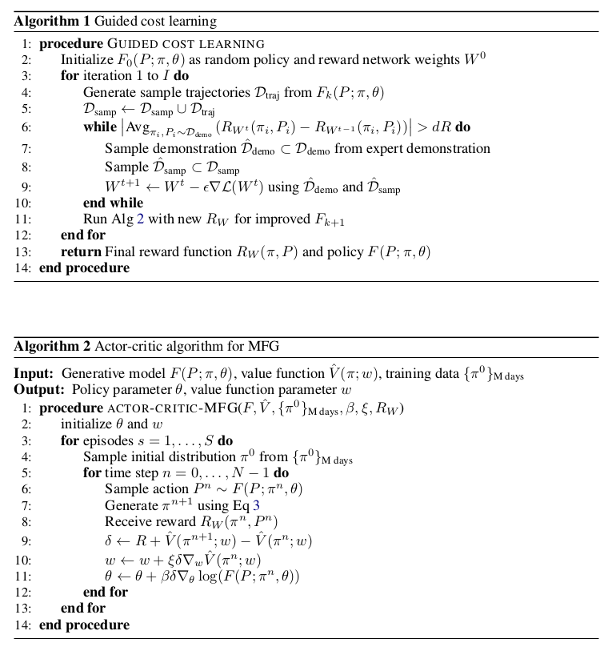
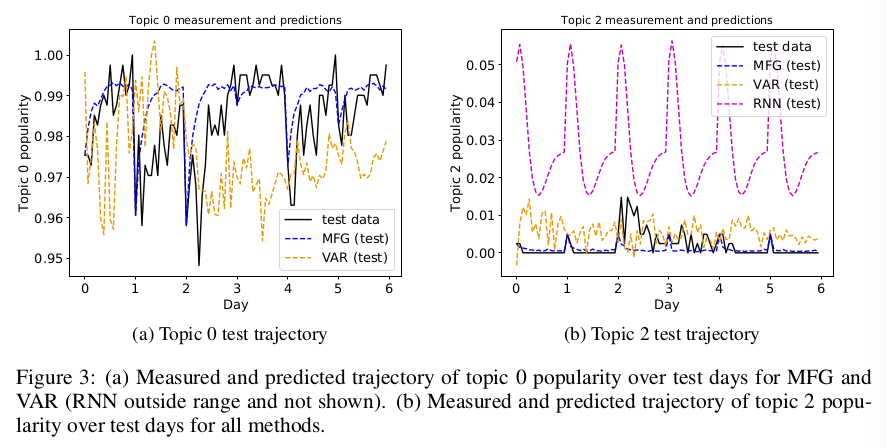

<h1>Learning deep mean field games for modeling
large population behavior</h1>

## J. Yang, X. Ye, R. Trivedi, H. Xu, H. Zha

---

## Abstract

---

## I - Introduction

* There is significant interest for modeling macroscopic population behavior,
first of all in physics, but also in social contexts, such as social media.
One of the major intuitions in such situations is that individual behavior
may be optimal with respect to some objective, yielding population dynamics.
It is also very likely that the current population state, when observable,
influences the individual actions (e.g. discussing already popular topics).

* This motivates the development of a **model of population behavior learnable
from real data** and satisfying some criteria:
  1. The model captures the **dependency between population distribution and
  their actions**.
  2. **Individual behaviors are modeled as optimal for some implicit reward**.
  3. The model enables **prediction of future population distribution**, given
  measurements at previous times.

 

* Those criteria are addressed using a **mean field game (MFG)** approach.
Stemming from game theory and economics, MFG consider the limit of $N$-player
games when $N$ tends to infinity.

* In MFG, the agent population is represented via their distribution over a
state space, and the individual reward depends on the population distribution
and aggregate actions.

* MFG are characterized by stochastic differential equations, and can be used
to model a wide range of phenomena (Mexican waves [Ola], where people put their
towel on the beach, etc).

 

* The problem is linked to **Markov Decision Processes (MDP)** and
**Reinforcement Learning (RL)** by framing it as **MFG model inference via
MDP policy optimization**. In other words, the MFG model is used to describe
the natural behavior of the population and is fitted by solving an associated
MDP, without imposing any control on the system.

* This is in some way the best of both worlds:
  * The MFG framework allows the tractable adaptation of **inverse reinforcement
  learning (IRL)** methods, to learn complex reward functions able to explain
  the behavior of arbitrarily large populations.
  * RL inspires a data-driven method to solve an MFG model of a real-world
  system for temporal prediction.

 

* In this paper:
  * **Data-driven fitting of an MFG model along with its reward function**
  * Reduction of a discrete time graph-state MFG (derived from the general case)
  to an MDP, which means that solving the MDP (policy and reward) is equivalent
  to inference of the MFG.

---

## II - Related work

* Prior work made strong assumptions on the cost function in order to attain
analytical solutions, hence the importance of **learning the cost function
directly from data**.

* Earlier work imposed Gaussian assumptions on the distributions, or relied
on numerical finite-difference methods for solving continuous MFG, limiting the
applications to **toy models** given the inherent computational challenges.

* In RL, multi-agent generalizations of the MDP are not easily used to represent
the interaction of thousands of agents, the trajectory of each being optimal,
hence the importance of the **macroscopic point of view** of MFG.

* In unknown MDP estimation and IRL, he **maximum entropy IRL framework**
has proved successful at learning reward functions from expert demonstrations.
It can be augmented by the use of deep neural networks to learn complex
reward functions.

* The presented method is an extension of **Guided Cost Learning** (Finn et al.,
  2016) to the problem of **learning a reward function under which a large
population's behavior is optimal**.

---

## III - Mean Field Games

### III.1 - Mean Field Games on graphs

* Let us first formalize the MFG setting over a graph. Let
$\mathcal{G} = (\mathcal{V}, \mathcal{E})$ be a **directed graph**, with
$\mathcal{V} = \{1, ..., d\}$ the **vertex set of $d$ possible states of each
agent**, and $\mathcal{E}$ the **edge set of possible direct transitions
between states**.

* We note:
  * $\mathcal{V}_i^- = \{j: (i,j) \in \mathcal{E}\}$
  * $\bar{\mathcal{V}}_i^- = \mathcal{V}_i^- \cup \{i\}$
  (possible previous states)
  * $\mathcal{V}_i^+ = \{j: (j,i) \in \mathcal{E}\}$
  * $\bar{\mathcal{V}}_i^+ = \mathcal{V}_i^+ \cup \{i\}$
  (possible next states)
  * $\mathbb{S}_i(\mathcal{G}) = \{ p \in \Delta^{d-1} | \ \text{supp}(p)
    \subset \bar{\mathcal{V}}_i^-\}$ (allowed actions for agents in state $i$)
  * $\mathbb{S}(\mathcal{G}) = \mathbb{S}_1(\mathcal{G}) \times ... \times
    \mathbb{S}_d(\mathcal{G})$ (allowed action matrices)

 

* **Population density is represented by $\pi(t)$**
$= (\pi_1(t), ..., \pi_d(t))\in \Delta^{d-1}$.
Population dynamics are generated by **transition matrices $P(t)
\in \mathbb{S}(\mathcal{G})$**
(right stochastic matrices, constrained by $\mathcal{E}$).

* We finally have a **value function $V_i(t)$** and a **reward function
$r_i(\pi(t), P_i(t))$**.

 

* Discrete time graph state MFG can be derived from the continuous time case
using the following equations (respectively **Hamilton-Jacobi-Bellman** and
**Fokker-Planck**):

<strong>

\[
  V_i^n = \max_{P_i^n \in \mathbb{S}_i(\mathcal{G})} \{ r_i(\pi^n, P_i^n) +
    \sum_{j \in \bar{\mathcal{V}}_i^-} P_{ij}^n V_j^{n+1} \}\\
  \pi_i^{n+1} = \sum_{j \in \bar{\mathcal{V}}_i^+}
  P_{ij}^n \pi_j^n
\]
</strong>

 

### III.2 - Discrete time MFG over a complete graph

* Complete graph for simplicity, readily generalizable to any directed graph

 

* Example of **user activity distribution over topics on social media**:
  * **Population distribution** - $\pi^n \in \Delta^{d-1}$
  for $n = 0, ..., N$, discrete probability distribution over $d$ topics.
  * **Transition matrix** - $P^n \in \mathbb{S}(\mathcal{G})$, with
  $P_{ij}^n$ the probability of people in topic $i$ switching to topic $j$
  at time $n$ ($P_i^n$ is the action of people in topic $i$). $P^n$ generates
  the population dynamics *via* the Fokker-Planck equation.
  * **Reward** - $r_i(\pi^n(t), P_i^n(t)) =
  \sum_{j=1}^d r_{ij}(\pi^n(t), P_{ij}^n(t))$ (with locality assumption)
  * **Value function** - $V_i^n$ is the expected maximum total reward of being
  in topic $i$ at time $n$ (we set $V^N = 0$).
  * **Average reward** - $e_i(\pi, P, V) = \sum_{j=1}^d P_{ij}(r_{ij}(\pi,P) +
  V_j)$ the average reward received by agents at topic $i$.

 

* Define $\mathcal{P}(P,i,q) \in \mathbb{S}(\mathcal{G})$ the matrix equal to
$P$, except with the $i$-th row replaced by $q$. $P$ is such that its rows form
a Nash equilibrium set of actions, i.e. $P$ is a **Nash maximizer**:

<strong>

\[
  \forall i, \forall q, \ \ e_i(\pi, P, V) \geq e_i(\pi, \mathcal{P}(P,i,q), V)
\]

</strong>
 

* A **solution of the MFG** is a sequence of pairs $\{(\pi^n, V^n)\}$
satisfying the Fokker-Planck equation and the optimality criteria:

<strong>

\[
  V_i^n = \max_{q \in \mathbb{S}_i(\mathcal{G})}
    \{\ \sum_{j=1}^d q_j \
      [\ r_{ij}(\pi^n, \mathcal{P}(P^n, i, q)) + V_j^{n+1}\ ]\  \}
\]

</strong>

---

## IV - Inference of MFG via MDP optimization

* Reduction of the discrete time MFG (over a complete graph)
to a **finite-horizon deterministic MDP**:
  * States - $\pi^n$
  * Actions - $P^n$
  * Reward - $R(\pi^n, P^n) =
                \sum_{i} \pi_i^n \sum_j P_{ij}^n r_{ij}(\pi^n, P_i^n)$
  * Finite-horizon state transition - $\pi_j^{n+1} = \sum_{i=1}^d P_{ij}^n
  \pi_i^n$

 

* This reduction (the MDP state trajectory under an optimal policy coincides
with the forward evolution of the MFG) means that **optimizing an MDP is
equivalent to solving an MFG that describes population behavior**. This enables
the use of inverse RL methods to learn an MFG along with its reward function.

 

### IV.1 - Reinforcement learning solution for MFG

* Sample-based IRL method based on the **maximum entropy** framework. Hypothesis
that trajectories are sampled from the maximum entropy distribution, where
$R_W(\tau) = \sum_n R_W(\pi^n, P^n)$:

<strong>

\[
  p(\tau) = \frac{1}{Z} \exp(R_W(\tau))
\]

</strong>

 

* The partition function $Z$ can be estimated via importance sampling.

* Building on Guided Cost Learning, the **reward function is approximated by
a neural network**, and learned via **likelihood maximization** (SGD on the
negative log likelihood).

* The **policy is learned using a simple actor-critic algorithm**, performing
gradient ascent on the policy's expected start value to find successively better
policies.

 

 

---

## V - Experiments

* Twitter population of 406 users, $d=15$ topics and $N=16$ time steps each day
for 27 days. Topics are indexed by order of decreasing popularity.

* Comparison with two baselines (Jensen-Shannon Divergence, or JSD, as metric):
  * **Vector auto-regression (VAR)** - order 18, trained on 21 trajectories
  * **Recurrent Neural Network (RNN)** - single FCL, ReLU

 

### V.1 - Interpretation of reward function

* Estimated reward functions densities are quite close, in terms of JSD, to
the observed ones, both in training and in testing. Although this does not mean
correspondence between the actual functions (the densities of two really
different functions can be quite close), it is a good indication of fit.

 

### V.2 - Trajectory prediction

* The learned policy was used to generate complete trajectories, given initial
distributions of each day.

* Note that learning the **MFG model only requires the initial population
distribution of each day**; on the opposite, VAR and RNN both use
the distributions over all hours of each day.

* Generated trajectories are presented below. The size of the data set, and
the fact that RNN mainly learn state transitions without accounting for actions
could explain the lower performance of the RNN.

 

 

---

## VI - Conclusion

* Extensions:
  * More flexible neural networks for more complex applications
  * Synthesis of MFG with models of social networks at the level of individual
  connections
  * Mean field models of interdependent systems that may display complex
  interactions via coupling through global states and reward functions
