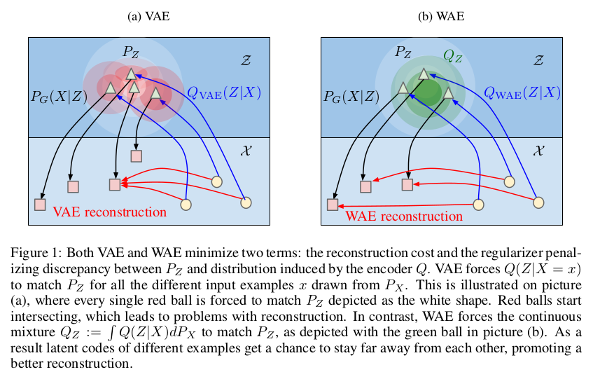

# Wasserstein Auto-Encoders

## I. Tolstikhin, O. Bousquet, S. Gelly, B. Schölkopf

---

## Abstract

---

## I - Introduction

* Recent work on **unsupervised generative modeling** (learning to produce
good quality samples from a given distribution, yielding the best quality while
covering the entire data distribution) is mostly based on two approaches
(finding a unifying framework is an open issue):
  * **Variational Auto-Encoders (VAE)** (encode input data into a latent space,
    use reconstruction as feedback), theoretically elegant, but producing
    blurry samples (on natural images)
  * **Generative Adversarial Networks (GAN)** (jointly train a generator G and a
    discriminator D, where D tries to discriminate real from fake data, and G
    tries to fool D by producing high quality samples; after training, drop D
    and keep only the generator G), producing impressive samples,
    but yielding no encoder, harder to train and suffering from the **mode
    collapse** problem (only one sample or one very small family of samples can
    be sampled, missing coverage of the true distribution)

 

* This works leverages the **Optimal Transport (OT)** cost, measuring distances
between probability distributions. In applications, data usually lies in low
dimensional manifolds in the input space $\mathcal{X}$; in this situation,
distances (such as $f$-divergences, measuring the density ratio between
distributions) used in typical GAN algorithms often max out (disjoint supports
of the distributions), yielding no useful gradient for training. Providing a
weaker topology, the OT cost attenuates this issue.

 

* In this paper:
  * **Minimization of the OT cost between the true (but unknown) data
    distribution, and a latent variable model (used as a generative model).**
  * **Wasserstein Auto-Encoders (WAE)**, a new family of AE designed to minimize
    a regularized version of this cost.
  * Empirical evaluation of WAE, showing the quality of generated samples.

---

## II - Proposed method

### II.1 - Preliminaries and notations

* We have data $X$ living in an input space $\mathcal{X}$, with a true but
unknown **data distribution $P_X$ from which we would like to sample**.
This goal is approached by approximating $P_X$ via a **latent variable model
$P_G$**, using latent codes $Z$ living in the latent space $\mathcal{Z}$.
$P_G$ is specified by a prior distribution $P_Z$ of latent codes $Z$, and the
**generative model $P_G(X|Z)$**. To this aim, we use an **encoder $Q(Z|X)$**,
yielding a distribution of encoded data $Q_Z := \mathbb{E}_{P_X}[Q(Z|X)]$.

* This work considers several measures of discrepancy between $P_X$ and $P_G$.
The WAE minimizes the **optimal transport cost $W_C(P_X, P_G)$**, but other
algorithms are based on *$f$-divergences* defined by $D_f(P_X||P_G) :=
\int f(\frac{p_X(x)}{p_G(x)}) p_G(x) dx$, including the classical
Kullback-Leibler $D_{KL}$ and Jensen-Shannon $D_{JS}$ divergences.

 

* The WAE tries to simultaneously achieve two conflicting goals, as shown in the
next figure:
  * Minimizing the reconstruction cost of encoded training examples.
  * **Matching the encoded distribution $Q_Z := \mathbb{E}_{P_X}[Q(Z|X)]$ to the
    prior $P_Z$**, as measured by any divergence $\mathcal{D}_Z(Q_Z, P_Z)$
    (regularization).

 

 

### II.2 - Optimal Transport and its dual formulation

* Given $c(x,y)$ a cost function and $\mathcal{P}(X \sim P_X, Y \sim P_G)$ the
set of all joint distributions of $(X,Y)$ with marginals $P_X$ and $P_G$
respectively, **Kantorovich's formulation of the Optimal Transport problem is:**

<strong>

\[
  W_c(P_X, P_G) := \inf_{\Gamma \in \mathcal{P}(X \sim P_X, Y \sim P_G)}
      \mathbb{E}_{(X,Y)\sim \Gamma}[c(X,Y)]
\]

</strong>

 

* An interesting case is when $(\mathcal{X},d)$ is a metric space and
$c(x,y) = d^p(x,y)$ for some $p \geq 1$; in this case, we note $W_p =
(W_c)^{1/p}$ the **p-Wasserstein distance**.

 

### II.3 - Application to generative models: Wasserstein Auto-Encoders

* Modern generative models like VAEs and GANs are trying to minimize certain
discrepancy measures between the data distribution $P_X$ and the model $P_G$.
However, most standard divergences are intractable, especially when $P_X$ is
unknown and $P_G$ parametrized by a deep neural network. Several tricks have
been developed to address this issue.

*
