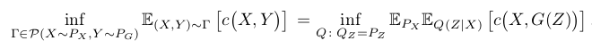
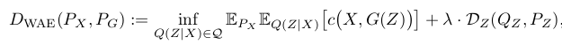
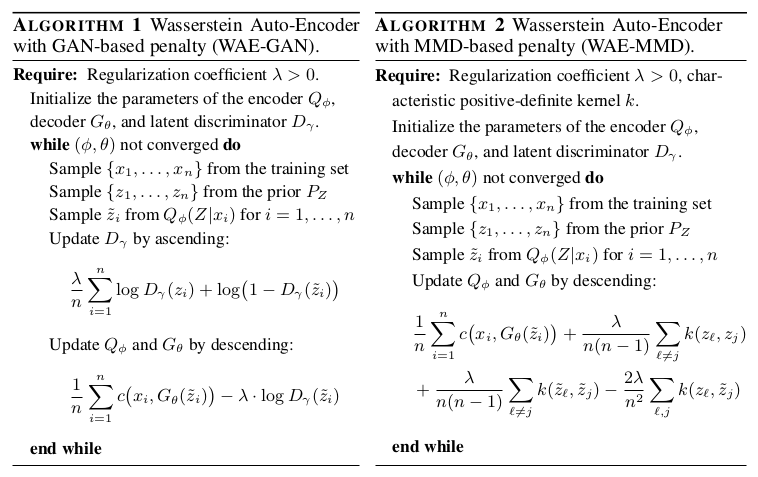

# Wasserstein Auto-Encoders

## I. Tolstikhin, O. Bousquet, S. Gelly, B. Schölkopf

---

## Abstract

Motivated by the recent development of unsupervised generative modeling, the
authors propose a novel family of auto-encoders, named Wasserstein Auto-Ecoders
(WAE). WAE, leveraging insights from both Variational Auto-Encoders (VAE) and
Generative Adversarial Networks (GAN), minimizes the Optimal Transport (OT)
discrepancy (linked to the Wasserstein distance) between the
true input data distribution and a latent variable model, generating fake
samples from codes living in the (low-dimensional) latent space.

WAE hence encodes input data into the latent space, and generates data in the
input space from latent codes. The reconstruction OT cost is regularized by
matching the encoded distribution of input examples with a prior in the latent
space, greatly increasing the performance and the quality of samples generated
when compared to Variational Auto-Encoders. The diversity of allowed costs and
regularizers yields great promises for future development.

---

## I - Introduction

* Recent work on **unsupervised generative modeling** (learning to produce
good quality samples from a given distribution, yielding the best quality while
covering the entire data distribution) is mostly based on two approaches
(finding a unifying framework is an open issue):
  * **Variational Auto-Encoders (VAE)** (encode input data into a latent space,
    use reconstruction as feedback), theoretically elegant, but producing
    blurry samples (on natural images)
  * **Generative Adversarial Networks (GAN)** (jointly train a generator G and a
    discriminator D, where D tries to discriminate real from fake data, and G
    tries to fool D by producing high quality samples; after training, drop D
    and keep only the generator G), producing impressive samples,
    but yielding no encoder, harder to train and suffering from the **mode
    collapse** problem (only one sample or one very small family of samples can
    be sampled, missing coverage of the true distribution)

 

* This works leverages the **Optimal Transport (OT)** cost, measuring distances
between probability distributions. In applications, data usually lies in low
dimensional manifolds in the input space $\mathcal{X}$; in this situation,
distances (such as $f$-divergences, measuring the density ratio between
distributions) used in typical GAN algorithms often max out (disjoint supports
of the distributions), yielding no useful gradient for training. Providing a
weaker topology, the OT cost attenuates this issue.

 

* In this paper:
  * **Minimization of the OT cost between the true (but unknown) data
    distribution, and a latent variable model (used as a generative model).**
  * **Wasserstein Auto-Encoders (WAE)**, a new family of AE designed to minimize
    a regularized version of this cost.
  * Empirical evaluation of WAE, showing the quality of generated samples.

---

## II - Proposed method

### II.1 - Preliminaries and notations

* We have data $X$ living in an input space $\mathcal{X}$, with a true but
unknown **data distribution $P_X$ from which we would like to sample**.
This goal is approached by approximating $P_X$ via a **latent variable model
$P_G$**, using latent codes $Z$ living in the latent space $\mathcal{Z}$.
$P_G$ is specified by a prior distribution $P_Z$ of latent codes $Z$, and the
**generative model $P_G(X|Z)$**. To this aim, we use an **encoder $Q(Z|X)$**,
yielding a distribution of encoded data $Q_Z := \mathbb{E}_{P_X}[Q(Z|X)]$.

* This work considers several measures of discrepancy between $P_X$ and $P_G$.
The WAE minimizes the **optimal transport cost $W_C(P_X, P_G)$**, but other
algorithms are based on *$f$-divergences* defined by $D_f(P_X||P_G) :=
\int f(\frac{p_X(x)}{p_G(x)}) p_G(x) dx$, including the classical
Kullback-Leibler $D_{KL}$ and Jensen-Shannon $D_{JS}$ divergences.

 

* The WAE tries to simultaneously achieve two conflicting goals, as shown in the
next figure:
  * Minimizing the reconstruction cost of encoded training examples.
  * **Matching the encoded distribution $Q_Z := \mathbb{E}_{P_X}[Q(Z|X)]$ to the
    prior $P_Z$**, as measured by any divergence $\mathcal{D}_Z(Q_Z, P_Z)$
    (regularization).

 

 

### II.2 - Optimal Transport and its dual formulation

* Given $c(x,y)$ a cost function and $\mathcal{P}(X \sim P_X, Y \sim P_G)$ the
set of all joint distributions of $(X,Y)$ with marginals $P_X$ and $P_G$
respectively, **Kantorovich's formulation of the Optimal Transport problem is:**

<strong>

\[
  W_c(P_X, P_G) := \inf_{\Gamma \in \mathcal{P}(X \sim P_X, Y \sim P_G)}
      \mathbb{E}_{(X,Y)\sim \Gamma}[c(X,Y)]
\]

</strong>

 

* An interesting case is when $(\mathcal{X},d)$ is a metric space and
$c(x,y) = d^p(x,y)$ for some $p \geq 1$; in this case, we note $W_p =
(W_c)^{1/p}$ the **p-Wasserstein distance**.

 

### II.3 - Application to generative models: Wasserstein Auto-Encoders

* Modern generative models like VAEs and GANs are trying to **minimize certain
discrepancy measures between the data distribution $P_X$ and the model $P_G$**.
However, most standard divergences are intractable, especially when $P_X$ is
unknown and $P_G$ parametrized by a deep neural network.

* Several tricks have been developed to address this issue (VAEs use the
theoretical framework provided by the *variational lower bound* when minimizing
the KL-divergence $D_{KL}; $f$-GANs leverage *adversarial training* to minimize
$f$-divergences; OT cost is another option).

 

* Here a **latent variable model $P_G$** is defined by first sampling a code $Z$
from a prior $P_Z$, then mapping $Z$ to the image $X$ with a possibly random
transformation $P_G(X|Z)$ (for simplicity assume deterministic mapping
$X = G(Z)$), yielding the density:

\[
  p_G(x) := \int_\mathcal{Z} p_G(x|z) p_Z(z) dz
\]

 

* It turns out that, in this form, the OT cost takes a simpler form, noting
the $Z$ marginal $Q_Z(Z) := \mathbb{E}_{X \sim P_X} [Q(Z|X)]$:

 

* This allows us to **optimize only over random encoders $Q(Z|X)$ instead of
optimizing over all couplings $\Gamma$**. This gives the **WAE objective**
(encoder $Q$ and decoder $G$ are parametrized by deep neural networks):

 

* Two different penalties (regularizations in the latent space, to avoid
overfitting the reconstruction cost):
  * **GAN-based** - choose $D_Z(Q_Z, P_Z) = D_{JS}(Q_Z, P_Z)$, and use
    adversarial training (introduce discriminator in the latent space)
  - **MMD-based** - choose $D_Z(Q_Z, P_Z) = MMD_k(Q_Z, P_Z)$ the *maximum mean
    discrepancy* (squared distance between the kernel embeddings of the
    distributions in a RKHS determined by $k$).

Note that those algorithms allow deterministic encoders $Q(Z|X)$

 

---

## III - Related work

### Literature on auto-encoders

* Classical auto-encoders: minimize only the reconstruction cost. But this
yields holes in $\mathcal{Z}$ where the decoder mapping $P_G(X|Z)$ has never
been trained (encoded points are scattered all across $\mathcal{Z}$). The
learned representation is not useful and sampling is very hard.

* VAEs minimize the reconstruction cost plus the regularizer $\mathbb{E}_{P_X}
[D_{KL}(Q(X|Z), P_Z)]$. The **VAE cost forces the image by the encoder of each
input sample $Q(X|Z)$ to match the prior $P_Z$**, and requires non-degenerate
encoders and random decoders (vs. WAE minimizing OT cost, allowing all
encoder-decoder pairs)

* WAE-GAN directly generalizes Adversarial Auto-Encoders (AAE), providing
a theoretical justification for AAE.

 

### Literature on OT

* WGAN minimizes $W_1(P_X, P_G)$ for generative modeling, but leveraging
a neat form of duality that does not hold for all cost functions.

* The computation of Optimal Transport is non-trivially constrained; various
approaches have been proposed to circumvent the difficulties. In this
work, OT is relaxed by adding a single extra divergence.

 

### Literature on GANs

* Ulyanov et al. (2017) use the discrepancy between $Q_Z$ and the distribution
$\mathbb{E}_{Z'\sim P_Z} [Q(Z|G(Z'))]$ of auto-encoded noise vectors, leading to
a max-min game between the encoder and decoder. The theoretical foundation
remains unclear.

* Several works used reproducing kernels in the context of GANs, but using
$MMD_k(P_X, P_G)$ directly in the input space $\mathcal{X}$. However, estimating
the MMD requires a number of samples roughly equal to the dimensionality of
the input space (typically larger than $10^3$, hence very large batch size).
WAE-MMD matches distributions via MMD in the latent space, whose dimension is
typically 100.

---

## IV - Experiments

* We want to achieve (tested on MNIST and CelebA):
  * **Accurate reconstructions** of input data points (training and test)
  * **Reasonable geometry of the latent manifold** (training and test)
  * **Good quality** of random samples

 

* Results globally show that **WAE yields samples of much better quality than
VAE**. WAE-GAN usually leads to a better matching and better samples than
WAE-MMD, but is highly unstable due to adversarial training (WAE-MMD has a very
stable training). Reconstructions are reasonable, and the geometry of the
latent manifold is designed to behave nicely.
