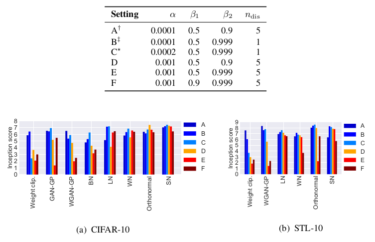
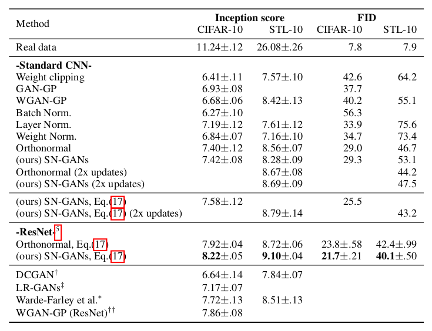
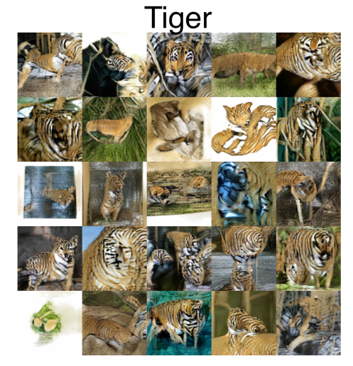

# Spectral normalization for $G$enerative Adversarial Networks

## T. Miyato, T. Kataoka, M. Koyama, Y. Yoshida

---

## Abstract

Despite their recent and impressive successes in unsupervised generative
modeling, Generative Adversarial Networks (GANs) are notoriously hard to train,
unstable, and suffer from the mode collapse problem, where only a very small
family of samples can be generated (failing to cover the entire multimodal
true distribution). A variety of normalization techniques have been proposed
to tackle this issue, with various levels of success.

The authors propose here a new normalization technique, named Spectral
Normalization, that intends to stabilize the training of the discriminator of
the GAN. It works by normalizing each layer's weight matrix by its spectral
norm, ensuring a small Lipschitz constant for the associated discriminator.
Additionally, the authors show that spectral normalization prevent each layer
from concentrating into a single direction, which helps reducing the mode
collapse.

Experimental results are very convincing and compare favorably to a range of
other regularization techniques. In particular, this work is the first to
achieve decent results on sample generation from ImageNet (with a single
generator-discriminator pair), since other methods tend to easily fall into
mode collapse.   

---

## I - Introduction

* **Generative Adversarial Networks (GANs)** have proven tremendously successful
recently in **unsupervised generative modeling** (learning to mimic a target
distribution). They roughly work as follows: train a generator $G$ and a
discriminator $D$, consecutively with one step for each in turn,
where $D$ tries to discriminate real from fake data, and $G$
tries to fool $D$ by producing realistic fake data; after training, drop $D$
and keep only the generator $G$.

* GANs are able to impressively **learn highly structured probability
distributions**, but the discriminator is interesting in its own right
(estimating a density ratio between target and generated distributions).

 

* However, GANs are notoriously **hard to train** and sensitive
**mode collapse** - in high dimensional spaces, the density ratio
learned by the discriminator is often inaccurate and very unstable, and the
generator resorts to a single mode of the true distribution, failing to cover
the multimodal structure (and producing only a very small family of samples).

* Moreover, when the supports of the target and generated distributions are
disjoint, a **perfect discriminator is reached**, and density ratio yields no
useful gradient: training stops. This motivates the restriction to smaller
classes of discriminators, a.k.a. regularization.

 

* In this paper:
  * **Spectral normalization**, a weight normalization method that can stabilize
  the training of the discriminator (requiring little implementation, tuning and
  computational cost)
  * Explanation of the effectiveness of Spectral Normalization (SN) against
  other regularization techniques.

---

## II - Method

* A neural discriminator, with input $x$, takes the form $D(x, \theta) =
\mathcal{A}(f(x, \theta))$ with $\theta$ the parameters to learn. **The standard
GAN formulation is given by:**

<strong>

\[
  \min_G \max_D V(G,D) \\

  \text{with}\ \ \ \ \ \  V(G,D) = \mathbb{E}_{x \sim q_{data}}[\log{D(x)}] +
                           \mathbb{E}_{x' \sim p_G}[1 - \log{D(x')}]
\]

</strong>

 

* Recent work stresses the impact of the allowed discriminator class on the
GAN performance, and **encourage the restriction to Lipschitz continuous
discriminators.** For example it is known that, for a fixed $G$, the standard
formulation leads to an optimal discriminator:

\[
  D^{* }_G(x) = \frac{q_{data}(x)}{q_{data}(x) + p_G(x)}
               = \text{sigmoid}(\log{{q_{data}(x)} - \log{p_G(x)}})
               = \text{sigmoid}(f^{* }(x)) \\
               \ \\
               \\
               \\
  \text{and its derivative} \ \ \ \ \
  \nabla_x f^{* }(x) = \frac{1}{q_{data}(x)} \nabla_x q_{data}(x) -
                       \frac{1}{p_G(x)} \nabla_x p_G(x) \\

  \text{can be unbounded or even uncomputable}
\]

 

* Some regularization would help tackling this issue. We therefore look for
the discriminator $D = \text{arg } \max_{{||f||}_{Lip} \leq K} V(G,D)$.

 

### II.1 - Spectral normalization

* Input-based regularizations are easily computed, but cannot impose
regularization outside the supports of the generated and target distributions
without some heuristics.

* Noting the **spectral norm $\sigma(A) = \max_{{||h||}_2 \leq 1}$** (equivalent
to the largest singular value), and given a linear layer $g(h) = Wh$, we have
${||g||}_{Lip} = \sigma(W)$. The composition rule for $L$ layers
therefore gives:

\[
  {||f||}_{Lip} \leq \prod_{l=1}^{L+1} \sigma(W^l)
\]

* **Spectral normalization controls the Lipschitz constant of the discriminator
function $f$ by constraining the spectral norm of each layer to be equal to 1**,
effectively ensuring that the Lipschitz constant of $f$ is bounded above by 1:

<strong>

\[
  \bar{W}_{SN}(W) := W / \sigma(W)
\]

</strong>

 

### II.2 - Fast approximation of the spectral norm $\sigma(W)$

* It turns out that we can use the power iteration method to estimate the
spectral norm with very small additional computational time.

 

### II.3 - Gradient analysis of the spectrally normalized weights

* The derivation of the gradient (see formula in the paper) shows that the new
version can be seen as a **regularized** version of the standard one,
adaptively penalizing the first component of the weight matrix.

* **Spectral normalization prevents each layer from concentrating into one
particular direction** along the course of the training.

---

## III - Spectral normalization vs. other regularization techniques

* **Weight normalization** - normalize the $l_2$ norm of each row in the weight
matrix (equivalent to Frobenius normalization, which requires the sum of
squared singular values to be 1). Unfortunately this tends to reduce the rank
of the weight matrix, i.e. reduce the number of features used in discrimination.
**Weight clipping** suffers from the same issue (vs. spectral norm is
independent of the rank).

* **Orthonormal regularization** - add a term $||{W^T W - I||}_F^2$ to the
adversarial objective. The purpose is the same as spectral normalization, but
it destroys all information about the spectrum by setting all the singular
values to 1 (vs. scaling the spectrum to have a maximum value of 1).

* **WGAN + Gradient Penalty** - add a regularizer to the objective that rewards
the function for having local 1-Lipschitz constant, on interpolated points
(between target and generated distributions). This is heavily dependent on the
support of the distributions, hence unstable, and more computationally
requiring.

---

## IV - Experiments

* Evaluate performance and compare against other regularization techniques,
(weight clipping, WGAN-GP, batch normalization BN, layer normalization LN,
weight normalization WN, orthonormal normalization)
on CIFAR-10, STL-10 and ImageNet (larger dataset).

 

### IV.1 - Results on CIFAR-10 and STL-10

Results (higher is better) with increasingly aggressive hyper-parameters (ADAM)
 
($n_{dis}$ is the number of updates of the discriminator for each update of
the generator)

 

* Spectral normalization proves **relatively robust to hyper-parameter
setting**, and outperforms almost all other options on optimal settings, except
orthonormal normalization (see IV.1.2 for further comparison).

 

 

* Visually, random samples generated by SN-GANs are **consistently better
(clearer and more diverse) than GANs with weight normalization**.

 

#### IV.1.1 - Analysis of SN-GANs

* Singular values analysis of the discriminator's weights show that, with
weight clipping or weight normalization, all layers tend to concentrate
on a few components, **the matrices are rank deficient**. This is especially
fatal in lower layers, where outputs live in a space that is linear in most
parts, and leads to an **oversimplified discriminator** since so many features
are discarded early. SN-GANs do not suffer from the same problem in the first
layers.

* Only very little additional computational time is required for spectral
normalization (in regard to total training cost of backpropagation), slightly
more than weight normalization, but much less than WGAN-GP.

 

#### IV.1.2 - Comparison between SN-GANs and Orthonormal regularization

* Orthonormal regularization, by destroying all spectral information, puts
equal emphasis on all features, including ones which shall be discarded. This
is useful in early layers, but empirically seems harmful in final layers, as
it possibly forces the discriminator to use all dimensions including
unnecessary ones (thus performs worse when the size of the last layer is
increased). SN-GANs seem more robust to network architecture changes.

 

### IV.2 - Image generation on ImageNet

* **Image generation with GANs on ImageNet is notoriously hard**, because of the
very high number of categories and the **mode collapse** problem (increasing the
number of classes causes mode collapse).

* Without normalization or with layer normalization, GANs spectacularly fail
to generate any meaningful image. Orthonormal and spectral normalization were
able to produce images, but only SN kept improving after 20k iterations.
**This is the first time that a single generator-discriminator pair has
succeeded in producing decent images from ImageNet**.

 

Tiger samples generated with SN-GAN on ImageNet

