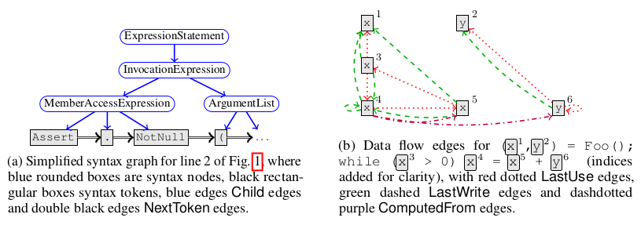

# Learning to represent programs with graphs

## M. Allamanis, M. Brockschmidt, M. Khademi

---

## Abstract

Both the availability of large source code repositories and the recent successes
of deep learning encourage the use of such powerful models to develop tools
designed to support software engineers on large scale projects. Driven by recent
progress made on the adaptation of neural networks to graph-structured input,
the authors propose here the representation of a program as a graph, with
terminals and non-terminals as nodes and both syntactic, semantic and data flow
related relationships as edges between those nodes. This enables the use of
a neural message passing algorithm (Gated Graph Neural Network)
to reason on those programs, and tackle two challenging tasks in machine
learning applied to source code - the prediction of a variable's name, and the
prediction of the correct variable to use at a given slot of a code file.
Experiments show promising results in this yet to be explored line of work.

---

## I - Introduction

* We would like to leverage the power of deep learning, the availability
of huge source code repositories and the rich and well-known structure of code
to develop tools to assist software engineers in code production and
maintenance.

* Previous deep learning models only capture the shallow, textual structure
of source code (sequence of tokens, parse trees, flat dependency networks of
variables). They hence do not fully and explicitly use semantic relationships
(e.g. "variable last used here"), which are likely to help the model training.

* Two tasks:
  * **VarNaming** - given some source code (with one variable's name masked),
    predict the "correct" name of the missing variable as a sequence of
    subtokens (e.g. `[input,stream,buffer]` for `inputStreamBuffer`).
  * **VarMisuse** - given a program file, infer which variable (among all
    possible ones) should be used in a specific location. An example is shown
    below, that no static analysis method can detect.

 

An example of VarMisuse task application. The model correctly predicted that
`clazz` is not the right variable to use here, and correctly proposed `first`.
This snippet is a simplified extract of the RavenDB open source C# project.

 

* Both tasks require some understanding of the **semantic role of a variable**
(e.g. "it is a counter"), and VarMisuse requires **variable usage semantics**
(e.g. "a filename is needed here"). This "fill the blank" task is related to
Word2Vec, but learning from source code can benefit from richer structure, such
as **data flow information**.

* The key insight of this work is to represent **programs as graphs**, with
edges encoding both syntactic relationships and semantic relationships.

 

* In this paper:
  * Definition of the VarMisuse task
  * Deep learning models solving VarNaming and VarMisuse by **learning program
    representation over the code's graph structure**
  * Evaluation of the models on real-world source code, and samples of bugs
    found

---

## II - Related work

* Previous work in machine learning for source code tasks does not explicitly
take **data flow information** into account when building models, only shallower
structure as mentioned above.

* Some work on program synthesis are able to complete gaps using provided
specifications, whereas this work statistically completes them only by learning
common variable usage patterns from code.

* There is a growing attention given to **neural networks on graphs**, able to
adapt deep learning to graph-structured input on a variety of applications. The
idea dates back to 2005, but recent work has shown the power of such an
approach, from example in drug design.

---

## III - The VarMisuse task

* Notations:
  * **$\mathcal{T} = t_0, ..., t_N$** a sequence of tokens representing the
    **source code file**
  * **$\mathbb{V} = \{t_{\lambda_0}, t_{\lambda_1}, ...\}$** the set of tokens
    that are **variables**
  * **$\mathbb{V}_t \subset \mathbb{V}$** the set of all type-correct variables
    in scope at location $t$, i.e. **variables that could be used at $t$ without
    raising a compilation error**.
  * **Slot** a token $t_{\lambda}$ where we want to predict the correct variable
    usage

 

* Task:
  * Given $t_0, ..., t_{\lambda - 1}, t_{\lambda + 1}, ..., t_N$
  * **Correctly select $t_{\lambda}$ from $\mathbb{V}_t$**.

 

* Note that often, several possible assignments could be considered correct.
This task requires understanding and reasoning about program *semantics*,
the role of elements and how they relate. This is different in scope from
code completion (the code is mostly complete, only variables are predicted).

---

## IV - Model: Programs as graphs

* The proposed model transforms program source code into program graphs, and
learn representations over them.

 

#### Gated Graph Neural Networks (GGNN)

* Input:
  * **Graph $\mathcal{G} = (\mathcal{V}, \mathcal{E}, X)$**
  * **Nodes $\mathcal{V}$**
  * **Edges $\mathcal{E} = (\mathcal{E}_1, ..., \mathcal{E}_K)$** with $K$ edge
    types
  * **Node features $X$**, with which we annotate each node $v$ with $x^{(v)}
    \in \mathbb{R}^D$ representing the features of the node (e.g. the embedding
    of a string label of the node).

 

* Representation learning:
  1. Associate every node $v$ with a **state vector $h^{(v)}$**, initialized
    with label $x^{(v)}$ (or a padded version)
  2. **Compute a message $m_k^{(v)} = f_k(h^{(v)})$** for each type $k$ and
    every node, with a chosen/learned $f$ (e.g. linear layer).
  3. **Send messages** to relevant neighbors, and compute for each node
    $\tilde{m}^{(v)} = g(\{\text{incoming messages of type } k\})$, with $g$
    an aggregation function (e.g. element-wise summation)
  4. **Update the state** of each node with $h'^{(v)} =
    \text{GRU}(\tilde{m}^{(v)}, h^{(v)})$ using a Gated Recurrent Unit (GRU)
  5. **Repeat steps 2, 3 and 4** for a number of iterations, then **use the
    last state vectors as the node representations**.

 

#### Program graphs

* **Nodes** (based on the **Abstract Syntax Tree (AST)**):
  * **Syntax nodes** - non-terminals
  * **Syntax tokens** - terminals

 

* **Edges**:
  * **Syntactic**:
    * `Child` - connect nodes according to the AST
    * `NextToken` - connect each syntax token to its successor
  * **Data flow related**:
    * `LastRead` - connect a variable token to the set of syntax tokens at which
      the variable could have been used last
    * `LastWrite` - connect a variable token to the set of syntax tokens at
      which the variable was last written to
    * `ComputedFrom` - after an assignment $v = expr$, connect variable token
      $v$ to all variable tokens occurring in $expr$
  * **Semantic**:
    * `LastLexicalUse` - chain all uses of the same variable (independent of
      data flow)
    * `ReturnsTo` - connect *return* tokens to the method declaration
    * `FormalArgName` - connect arguments in method calls to formal parameters
    * `GuardedBy` - in `if ($x>y$) {... x ...} else {... y ...}`,
      connect *$x$* to *$x>y$*
    * `GuardedByNegation` - in `if ($x>y$) {... x ...} else {... y ...}`,
      connect *$y$* to *$x>y$*
  * **Backwards edges** to help the information propagation

 

 

#### Initial node representation

* Assume a statistically typed language and a compilable source code - each
variable has a known type $\tau(v)$.

* Define a **learnable type embedding function $r(\tau)$**, with additional
information coming from type hierarchy.

* Average the embeddings of subtokens (e.g. `classTypes -> [class,types]`) to
get an **embedding for the node name**.

* Compute the initial node state as a concatenation of the type embedding and
the name representation, passed through a linear layer.

 

#### Program graphs for VarNaming

* Build the program graph, replace the variable name in all relevant tokens by
a special `<SLOT>` token.

* Use initial node labels, run GGNN propagation for 8 time steps, compute a
variable usage representation by averaging the representations of all `<SLOT>`
tokens.

* Feed this representation to a one-layer GRU which predicts the variable name
as a sequence of subtokens.

 

#### Program graphs VarMisuse

* Compute a **context representation $c(t)$** for the relevant slot $t$, by
creating a special "hole" node and connecting it to the graph using all
applicable edges that do not depend on the chosen variable at the slot.

* Compute a **usage representation $u(t,v)$** for all candidate variables
by inserting a corresponding candidate node and connecting it accordingly to the
graph.

* Initialize, run GGNN for 8 steps; $c(t)$ and $u(t,v)$ are taken as the final
states of the corresponding nodes, and the correct variable usage is computed as
$\arg \max_v W[c(t),u(t,v)]$ with $W$ is a linear layer.

---

## V - Evaluation

* Evaluation shows excellent performance on both tasks, outperforming
bidirectional RNN baselines by far. Generalization to new, unseen projects does
not hurt the performance too much.

 

 

* Ablation study shows that semantic (and data flow) edges are crucial to the
performance of the algorithm, as expected.

* During the application of the model to the VarMisuse task, some bugs or
inconsistencies were discovered in large scale open source programming projects,
supporting the claim that this line of work would be helpful in supporting
software engineers in the future.

 

