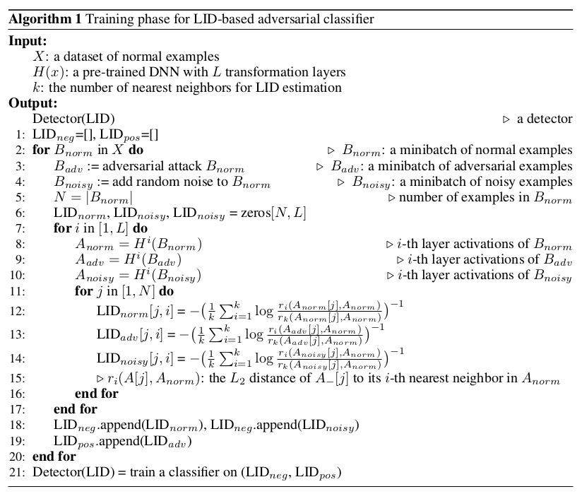
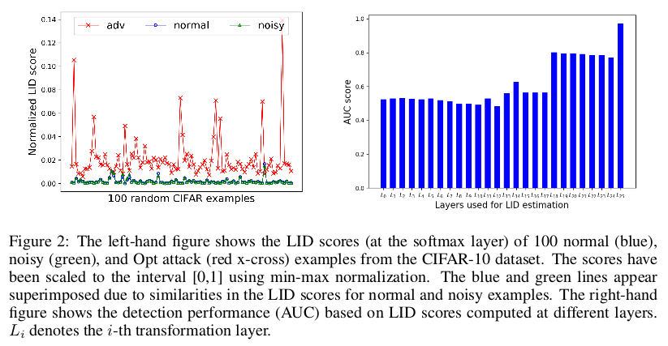
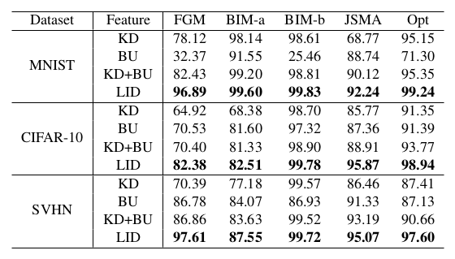
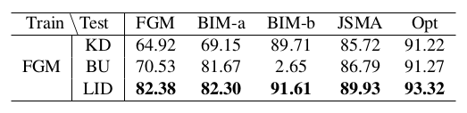

# Characterizing adversarial subspaces using Local Intrinsic Dimensionality

<h2> X. Ma, B. Li, Y. Wang, S.M. Erfani, S. Wijewickrema, G. Schoenebeck,
D. Song, M.E. Houle, J. Bailey </h2>

---

## Abstract

---

## I - Introduction

* Despite the recent successes on a variety of tasks, Deep Neural Networks
(DNNs) have proved **vulnerable to adversarial attacks**, i.e. inputs
intentionally perturbed to be misclassified with high confidence at test time.

* Adversarial perturbations are often imperceptible to humans, and often
transferable between models with comparable architectures. This is a **major
security concern** in real-world applications (biometrics, self-driving cars).

 

* Adversarial inputs live in **adversarial regions** or **adversarial
subspaces**, where all points are similarly misclassified.

* No method has been able to reliably characterize adversarial subspaces yet.
Assuming that natural **data can be modeled with a collection of manifolds**,
recent work show some **properties of adversarial regions**:
  * They are **low probability** regions, not naturally occurring
  * They span a **contiguous multidimensional space**
  * They lie off but close to the **data sub-manifold**
  * They are misclassified

 

* Two defense/detection methods proposed (with limitations):
  * **Kernel density (KD)**, taking advantage of the low probability density
    in adversarial subspaces
  * **k-mean distance**

 

**Exemple failure of Kernel Density and k-mean distance methods**

 

* The figure motivates the use of **Local Intrinsic Dimensionality (LID)**,
an expansion-based measure that estimates the intrinsic dimensionality of the
local data sub-manifold *via* the growth characteristics of the cumulative
distribution function in the vicinity of the reference point.

* As illustrated in the figure, the **LID score is expected to be much higher
for adversarial examples** than for normal inputs, enabling efficient detection.

 

* In this paper:
  * **LID characterization of adversarial regions of deep networks**.
  * Efficient detection of adversarial inputs at test time, on state-of-the-art
    attacks, using a mini-batch of training data
  * Generalization ability of the LID detector from one attack type to others,
    and robustness to white box attacks.

---

## II - Related work

#### Adversarial attack

* Variety of **attack approaches**:
  * **Fast Gradient Method (FGM)** - perturb by a small amount along the
    gradient direction
  * **Basic Iterative Method (BIM)** - iterative version of FGM
    * **BIM-a** - stop right after misclassification
    * **BIM-b** - iterate for a fixed number of steps
  * **Jacobian-based Saliency Map Attack (JSMA)** - iteratively perturb the
    two most effective pixels based on the adversarial saliency map, repeat
    until misclassification
  * **Optimization-based (Opt)** - solve an optimization problem

 

#### Adversarial defense

* Variety of **defense techniques**:
  * **Adversarial training**
  * Distillation
  * Gradient masking
  * Feature squeezing

 

* Most defense mechanisms can be bypassed by Opt. Development of **detection
tools** to discriminate adversarial inputs from normal/noisy inputs (based on
features extracted at various layers of a DNN) (vulnerable as well):
  * Detection subnetworks based on activation
  * Cascade detector based on the PCA projection of activations
  * ...
  * Logistic regression based on KD and Bayesian Uncertainty

---

## III - Local Intrinsic Dimensionality

* **Intuition**: in Euclidean space, the volume of an $m$-dimensional ball grows
as $r^m$. From two measurements and $\frac{V_2}{V_1} = (\frac{r_2}{r_1})^m$,
we get the **expansion dimension $m$** $= \frac{\ln(V_2/V_1)}{\ln(r_2/r_1)}$

* **By treating mass probability as a proxy for volume, classical expansion
models provide a local view of the dimensional structure of the data**, as their
estimation is restricted to a neighborhood around the reference point.

* Noting $F(r)$ the cumulative distribution function, the **Local Instrinsic
Dimensionality** is defined as:

<strong>

\[
  \text{LID}_F(r) = \frac{r \cdot F'(r)}{F(r)} \\

  \text{LID}_F = \lim_{r \rightarrow 0} \text{  LID}_F(r)
\]

</strong>

 

* The LID gives a rough indication of the dimension of the sub-manifold
containing $x$ that would best fit the data distribution in the vicinity of $x$.

 

#### Estimation of LID

* It turns out that, under mild assumptions, the extreme value theory enables
the estimation of LID *via* the Maximum Likelihood Estimator:

\[
\hat{LID}(x) = - (\frac{1}{k} \sum_{i=1}^{k} \log \frac{r_i(x)}{r_k(x)})^{-1}
\]

---

## IV - Characterizing adversarial subspaces

#### LID of adversarial subspaces

* Consider a sample $x \in X$ (set of normal examples) lying within a data
sub-manifold $S$, and a **new sample $x'$ resulting from an adversarial
perturbation of $x$**.

* The theoretical LID of $x$ is simply the the local dimension of $S$.
Similarly, if we could compute the theoretical LID of $x'$ (with respect to
the full adversarial region, not to the true data manifolds), it would be the
(local) dimension of the corresponding adversarial region. Recent work shows
that such regions span contiguous subspaces whose dimension is comparable to
the *representational dimension*, i.e. the dimension of the full data domain
(e.g. 3x128x128), which is much larger than the dimension of any data
sub-manifold. This means that **the theoretical LID of $x'$ (w.r.t. the
adversarial region) is far greater than that of $x$ (w.r.t. $S$)**.

 

* **We must however estimate the LID from data samples**. Provided that the
dimension of $S$ is reasonably low, estimation *via* the $k$-nearest neighbors
of the LID of $x$ is expectedly accurate enough.

* The theoretical LID of $x'$ w.r.t. the adversarial subspace cannot be
estimated easily with true data only (not enough adversarial examples, most
likely required number of examples is too high anyway). However, **the nearest
neighbors of $x'$ are likely drawn from more than one (true data) manifold**;
despite the proximity to $S$, if all neighbors were drawn from $S$, $x'$ would
probably not be an adversarial example.

* This means that the neighbors of $x'$ together span a number of data manifolds
at the same time, yielding a subspace of much higher intrinsic dimensionality
than any individual subspace. In other words, **the LID of $x'$ with respect to
the true data samples can be expected to be much higher than that of $x$**.

 

#### Efficiency through minibatch sampling

* Computing the LID with respect to the whole dataset $X$ is generally
intractable. We expect the estimation to be reasonably accurate when computed
on a large enough random minibatch of training data, especially if the gap
between normal and adversarial LID is huge.

* It turns out that, despite the variance of the estimates, a batch size of 100
and a neighborhood size of 20 seem enough to discriminate between adversarial
and non-adversarial examples.

 

#### Using LID to characterize adversarial examples

 

 

* For any new test example, a new random minibatch of training data is used to
estimate the LID after each layer of the DNN, and those extracted features are
fed to the classifier previously trained with the algorithm above.

---

## V - Evaluating LID-based characterization of adversarial examples

### V.2 - LID characteristics of adversarial examples

 

 

* The various plots support the main previous hypotheses. The LID scores of
adversarial examples are significantly higher than those of normal or noisy
examples. LID is quite robust to the parameter choice.

* The plots also show that adversarial discrimination becomes possible at
dense layers, and much easier at the softmax layer, which thus may be more
sensitive to adversarial perturbations than convolutional transformations.

 

### V.3 - Analysis of LID properties

#### Performance

 

AUC score of a logistic regression classifier with different features  
trained on different attack types (and tested on the same)

 

#### Generalizability

 

AUC score of a logistic regression classifier with different features  
**trained on FGM attacks and tested on other attack types**

 

#### Effect of minibatch size

* The instability of LID estimation at minibatch size of 100 is compensated by
the discriminator training; however, increasing the batch size seems to
further improve the detection performance. The trade-off terms need to be
investigated in future work.

 

#### Adaptive attack against LID measurement

* It is interesting to test the robustness of the LID classifier in the white
box setting, where the Opt framework has access to the model and crafts
$L_2$ attacks by minimizing the objective:

\[
  \min 
\]

<!-- NOTE The LID relies on the (somewhat strong, but apparently effective)
assumption that the neighborhood of an adversarial example will span
multiple sub-manifolds. An additional feature would be to consider how the
neighborhood relates to the reference point. Take a line (data manifold),
a point outside the line (adversarial example), and grow a ball around the
point. The vectors from the reference point to its nearest neighbors
on the line will probably have pairwise scalar products that are rather
positive if the point is far enough from the line. On the other hand, for
any point right on the line, such scalar products would probably be somewhat
randomly positive or negative -->
