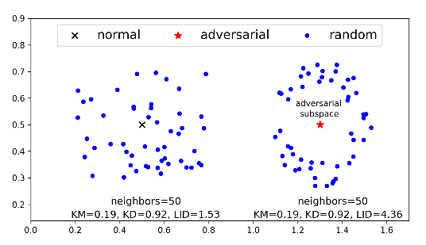

# Characterizing adversarial subspaces using Local Intrinsic Dimensionality

<h2> X. Ma, B. Li, Y. Wang, S.M. Erfani, S. Wijewickrema, G. Schoenebeck,
D. Song, M.E. Houle, J. Bailey </h2>

---

## Abstract

---

## I - Introduction

* Despite the recent successes on a variety of tasks, Deep Neural Networks
(DNNs) have proved **vulnerable to adversarial attacks**, i.e. inputs
intentionally perturbed to be misclassified with high confidence at test time.

* Adversarial perturbations are often imperceptible to humans, and often
transferable between models with comparable architectures. This is a **major
security concern** in real-world applications (biometrics, self-driving cars).

 

* Adversarial inputs live in **adversarial regions** or **adversarial
subspaces**, where all points are similarly misclassified.

* No method has been able to reliably characterize adversarial subspaces yet.
Assuming that natural **data can be modeled with a collection of manifolds**,
recent work show some **properties of adversarial regions**:
  * They are **low probability** regions, not naturally occurring
  * They span a **contiguous multidimensional space**
  * They lie off but close to the **data sub-manifold**
  * They are misclassified

 

* Two defense/detection methods proposed (with limitations):
  * **Kernel density (KD)**, taking advantage of the low probability density
    in adversarial subspaces
  * **k-mean distance**

 

**Exemple failure of Kernel Density and k-mean distance methods**

 

* The figure motivates the use of **Local Intrinsic Dimensionality (LID)**,
an expansion-based measure that estimates the intrinsic dimensionality of the
local data sub-manifold *via* the growth characteristics of the cumulative
distribution function in the vicinity of the reference point.

* As illustrated in the figure, the **LID score is expected to be much higher
for adversarial examples** than for normal inputs, enabling efficient detection.

 

* In this paper:
  * **LID characterization of adversarial regions of deep networks**.
  * Efficient detection of adversarial inputs at test time, on state-of-the-art
    attacks, using a mini-batch of training data
  * Generalization ability of the LID detector from one attack type to others,
    and robustness to white box attacks.

---

## II - Related work

#### Adversarial attack

* Variety of **attack approaches**:
  * **Fast Gradient Method (FGM)** - perturb by a small amount along the
    gradient direction
  * **Basic Iterative Method (BIM)** - iterative version of FGM
    * **BIM-a** - stop right after misclassification
    * **BIM-b** - iterate for a fixed number of steps
  * **Jacobian-based Saliency Map Attack (JSMA)** - iteratively perturb the
    two most effective pixels based on the adversarial saliency map, repeat
    until misclassification
  * **Optimization-based (Opt)** - solve an optimization problem

 

#### Adversarial defense

* Variety of **defense techniques**:
  * **Adversarial training**
  * Distillation
  * Gradient masking
  * Feature squeezing

 

* Most defense mechanisms can be bypassed by Opt. Development of **detection
tools** to discriminate adversarial inputs from normal/noisy inputs (based on
features extracted at various layers of a DNN) (vulnerable as well):
  * Detection subnetworks based on activation
  * Cascade detector based on the PCA projection of activations
  * ...
  * Logistic regression based on KD and Bayesian Uncertainty

---

## III - Local Intrinsic Dimensionality

* **Intuition**: in Euclidean space, the volume of an $m$-dimensional ball grows
as $r^m$. From two measurements and $\frac{V_2}{V_1} = (\frac{r_2}{r_1})^m$,
we get the **expansion dimension $m$** $= \frac{\ln(V_2/V_1)}{\ln(r_2/r_1)}$

* **By treating mass probability as a proxy for volume, classical expansion
models provide a local view of the dimensional structure of the data**, as their
estimation is restricted to a neighborhood around the reference point.

* Noting $F(r)$ the cumulative distribution function, the **Local Instrinsic
Dimensionality** is defined as:

<strong>

\[
  \text{LID}_F(r) = \frac{r \cdot F'(r)}{F(r)} \\

  \text{LID}_F = \lim_{r \rightarrow 0} \text{  LID}_F(r)
\]

</strong>

 

* The LID gives a rough indication of the dimension o the sub-manifold
containing $x$ that would best fit the data distribution in the vicinity of $x$.

 

#### Estimation of LID

* It turns out that, under mild assumptions, the extreme value theory enables
the estimation of LID *via* the Maximum Likelihood Estimator:

\[
\hat{LID}(x) = - (\frac{1}{k} \sum_{i=1}^{k} \log \frac{r_i(x)}{r_k(x)})^{-1}
\]

---

## IV - Characterizing adversarial subspaces

#### LID of adversarial subspaces

* Consider a sample $x \in X$ (set of normal examples) lying within a data
sub-manifold $S$, and a new sample $x'$ resulting from an adversarial
perturbation of $x$.

* The LID of $x$ is simply the the local dimension of $S$. However, 
